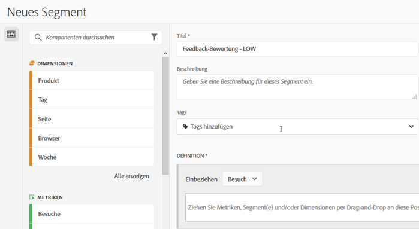
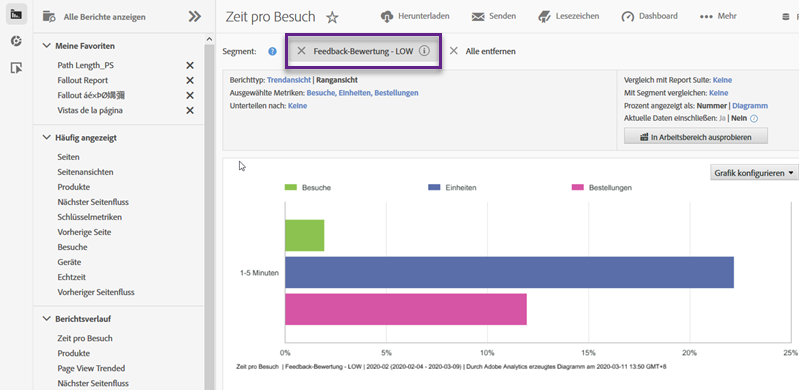

# Verwenden der Integration {#using-the-integration}

Nach der Bereitstellung können Sie die zusätzlichen Funktionen dieser Integration nutzen. Die folgenden Aktionen sind erforderlich, um aus dieser Integration in Adobe Analytics Nutzen zu ziehen.

>[!NOTE]
>
>Es kann 24–48 Stunden dauern, bis Kampyle-Antwortdaten in Ihren Adobe Analytics-Berichten angezeigt werden.

## Kombinieren von Feedback- und Onsite-Verhaltensdaten {#mix-feedback-and-onsite-behavior-data}

Sie können Reports &amp; Analysen-Berichte nach Feedback-Dimensionen unterteilen.

Mithilfe von Adobe Reports &amp; Analysen können Sie einen Drilldown in zahlreichen Feedback-Dimensionen durchführen, die in Berichten verfügbar sind. Der unten stehende Bericht ist ein Beispiel für das detaillierte Anzeigen einer bestimmten Feedback-Kategorie und deren anschließende Unterteilung nach der Feedback-Beschreibung. Die Metriken aus Reports &amp; Analysen („Besuche“ und „Kundendienstanfragen“) und Kampyle („Durchschnittliche Feedback-Bewertung“) werden zur einfachen Analyse nebeneinander dargestellt.

## Segmentieren nach Feedback-Dimension {#segment-by-feedback-dimension}

Sie können Segmente basierend auf Feedback-Dimensionen erstellen.

Eine wichtige Funktion dieser Integration ist die Möglichkeit, Adobe Analytics-Segmente basierend auf den Kampyle-Feedback-Dimensionen zu erstellen. Sie können beispielsweise ein Segment erstellen, das nur Besuche mit einer Bewertung von 1 oder 2 umfasst. Sie könnten dies „Feedback-Bewertung – NIEDRIG“ nennen. Diese Segmentdefinition würde wie folgt aussehen:

Dieses Segment kann dann auf praktisch jeden Bericht angewendet werden. Ein Beispiel dafür ist der hier angezeigte „Time Spent per Visit Report“ (Bericht über die pro Besuch verbrachte Zeit).

