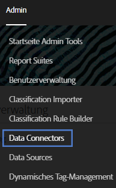
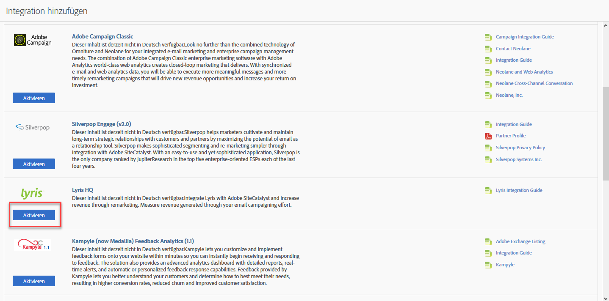
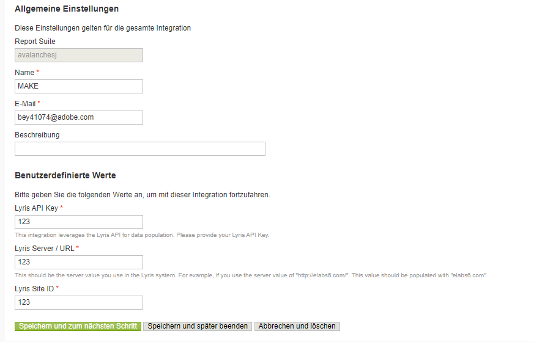
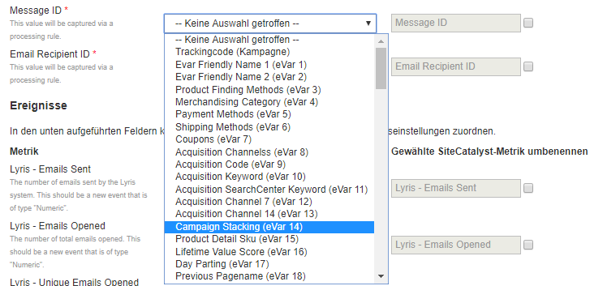
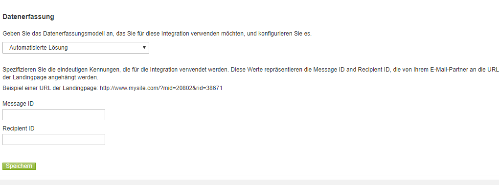
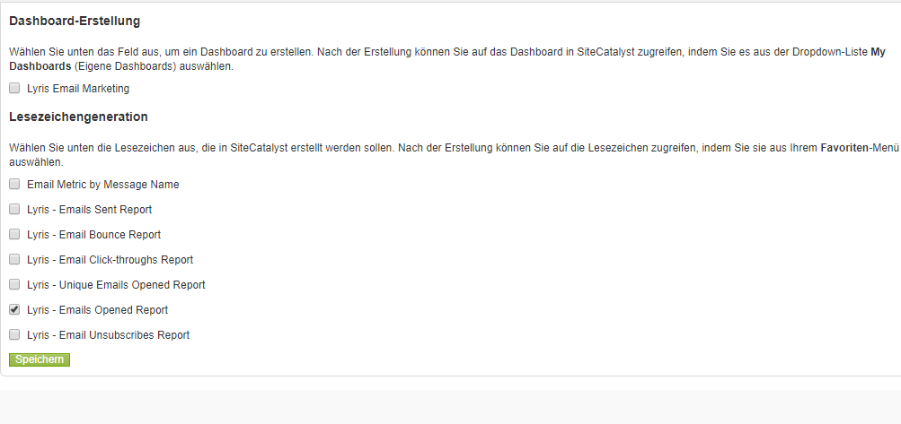
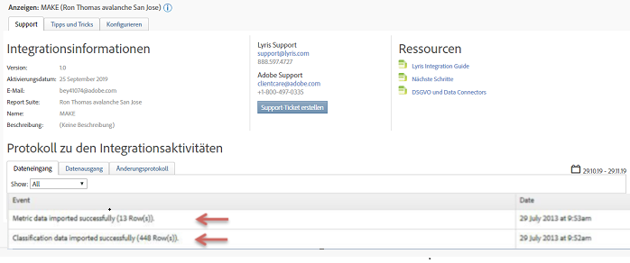

# Bereitstellen der Integration {#deploying-the-integration}

Beschreibt den dreistufigen Bereitstellungsprozess.

Die Bereitstellung dieser Integration ist ein einfacher Prozess, der die folgenden Aktionen erfordert:

## Abschließen des Integrationsassistenten {#completing-the-integration-wizard}

Schritte zum Verwenden des Integrationsassistenten.

Zum Aktivieren der Integration müssen Sie den Lyris-Integrationsassistenten auf der Data Connectors-Oberfläche ausführen.

1. Navigieren Sie in der Adobe Experience Cloud zum Bereich „Data Connectors“ (früher Genesis).

   

1. Klicken Sie unter **[!UICONTROL Add Integration]** Lyris HQ auf **[!UICONTROL Activate]**.

   

1. Under **[!UICONTROL General Settings]**, choose the desired Report Suite and provide a name for the integration.
1. Fill in all your Lyris account-related information under **[!UICONTROL Custom Values]**.

   

1. Wählen Sie die entsprechenden reservierten eVars und Ereignisse aus den Dropdown-Menüs aus.

   

1. You may choose your own segments under **[!UICONTROL Your Segments]** - apart from the 3 automated Partner segments.
1. Bei dieser Integration kann es sein, dass Sie einige Datenpunkte in Ihr Lyris-Konto herunterladen müssen. You may choose to give access for this under **[!UICONTROL Access Request]**.
1. Under **[!UICONTROL Data Collection]**, you can choose to have an automated or a manual solution (JavaScript Plug-in) to collect query string parameters from the landing page URL. Wenn Sie sich für eine automatisierte Lösung entscheiden, geben Sie Ihren Abfragezeichenfolgenparameter für die Nachrichten-ID und Empfänger-ID ein. Wenden Sie sich für ein JavaScript-Plug-in an Ihren Adobe-Berater.

   

1. Sie können das Lyris Dashboard und die Lesezeichen automatisch für Sie generieren lassen.

   

1. Review the integration summary and click **[!UICONTROL Activate]**.

## Konfiguration in Lyris EmailLabs {#configuration-within-the-lyris-emaillabs}

In diesen Schritten ist beschrieben, was nach Abschluss des Assistenten in Lyris konfiguriert werden soll.

1. Nach Abschluss des Integrationsassistenten müssen Sie mit dem Lyris Professional-Team zusammenarbeiten, um die Integration in Ihr Lyris HQ-Konto abzuschließen und Tests zu erleichtern.
1. Fügen Sie URL-Abfragezeichenfolgenparameter hinzu: Vergewissern Sie sich, dass die angehängte URL-Zeichenfolge ordnungsgemäß in die Organisationseinstellungen der Benutzeroberfläche eingegeben wurde. Diese sollte die Kampagnenebenen-ID (hq_m) und die ID der Empfängerebene (hq_v) enthalten.

   Beispiel einer Zeichenfolgen-ID:

   ```
   hq_lid=149&hq_m=96843&hq_l=23&hq_v=7703a51905
   ```

   >[!NOTE]
   >
   >Wenn Sie das native Analysetool von Lyris anwenden, markiert *Klick-Tracking* alle hinzugefügten erforderlichen Variablen.

## Überprüfen der Integration {#verifying-the-integration}

Schritte zum Überprüfen, ob die Lyris-/Adobe Analytics-Integration erfolgreich war.

Nach Abschluss sämtlicher Implementierungsschritte können Sie überprüfen, ob die Integration die Daten erfolgreich übertragen hat.

>[!NOTE] Es dauert ein paar Tage, bis der Datenaustausch beginnt. Wenden Sie sich nach der Aktivierung der Integration an Lyris.

1. Navigieren Sie zu Ihrer Lyris-Integration in „Data Connectors“. Unter der **[!UICONTROL Support]** Registerkarte > **[!UICONTROL Integration Activity Log]** sollten Sie Ereignisse wie **[!UICONTROL Metric data imported successfully]** und/oder **[!UICONTROL Classification data imported successfully]**:

   

1. Zeigen Sie jetzt Ihre Lyris-Nachrichtenberichte mit den entsprechenden Metriken an. In the Adobe Experience Cloud, select **[!UICONTROL Reports & Analytics]**.
1. Wählen Sie die gewünschte Report Suite aus.
1. Wählen Sie **[!UICONTROL Custom Conversions]** unter &quot; **[!UICONTROL Message ID Reports]** und wählen Sie **[!UICONTROL Message ID/Message Name]**&quot;aus.

## Abfragezeichenfolgen-Param-Plug-in-Code {#query-string-param-plug-in-code}

Zeigt den Lyris-Plug-in-Code zur Verwendung mit Adobe Analytics an.

>[!NOTE] Stellen Sie sicher, dass Sie die erforderlichen eVars im Admin Tool von Adobe Analytics reserviert haben, bevor Sie mit dem unten stehenden Code arbeiten. Sobald Sie wissen, welche eVars Sie reserviert haben, ersetzen Sie eVarN durch die entsprechende eVar. Zum Beispiel eVar10.

```
/* 
  * Plugin: getQueryParam 2.3 
  */ 
s.getQueryParam=new Function("p","d","u","" 
+"var s=this,v='',i,t;d=d?d:'';u=u?u:(s.pageURL?s.pageURL:s.wd.locati" 
+"on);if(u=='f')u=s.gtfs().location;while(p){i=p.indexOf(',');i=i<0?p" 
+".length:i;t=s.p_gpv(p.substring(0,i),u+'');if(t){t=t.indexOf('#')>-" 
+"1?t.substring(0,t.indexOf('#')):t;}if(t)v+=v?d+t:t;p=p.substring(i=" 
+"=p.length?i:i+1)}return v"); 
s.p_gpv=new Function("k","u","" 
+"var s=this,v='',i=u.indexOf('?'),q;if(k&&i>-1){q=u.substring(i+1);v" 
+"=s.pt(q,'&','p_gvf',k)}return v"); 
s.p_gvf=new Function("t","k","" 
+"if(t){var s=this,i=t.indexOf('='),p=i<0?t:t.substring(0,i),v=i<0?'T" 
+"rue':t.substring(i+1);if(p.toLowerCase()==k.toLowerCase())return s." 
+"epa(v)}return ''"); 
 
/*in the s_doPlugins function - Replace N with actual eVar number*/ 
s.eVarN=s.getQueryParam("<insert Lyris QS Param>");  
//places query param value from Message ID in eVarN variable s.eVarN=s.getQueryParam("<insert Lyris QS Param>");  
//places query param value from Recepient ID in eVarN variable 
```
