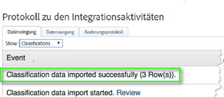
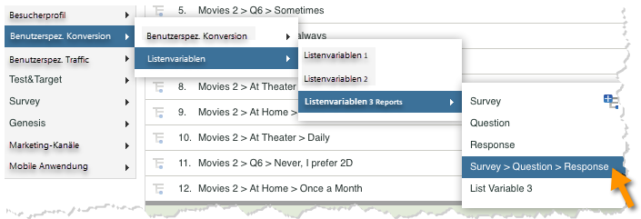
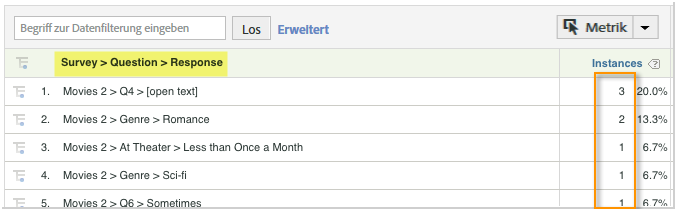

# Bereitstellen der Integration {#deploying-the-integration}

Die Bereitstellung dieser Integration ist ein einfacher Prozess, der die folgenden Aktionen erfordert.

## Abschließen des Adobe-Integrationsassistenten {#completing-the-adobe-integration-wizard}

Zum Aktivieren der Integration müssen Sie den Qualtrics-Integrationsassistenten auf der Data Connectors-Oberfläche ausführen.

1. Navigieren Sie zu den Data Connectors. Starten Sie dann den Qualtrics-Integrationsassistenten.
1. Wählen Sie die Report Suite aus, die Sie für diese Integration verwenden möchten, und geben Sie einen Namen ein.

   Führen Sie den Integrationsassistenten aus. Geben Sie dann die in den folgenden Schritten beschriebenen Informationen ein. 1. **Assistent: Schritt 1**

   | E-Mail-Adresse | Die E-Mail-Adresse des Hauptkontakts. |
   |---|---|
   | Beschreibung | (Optional) Beschreibung für die Einrichtung dieser Integration. |
   | Organisations-ID von Qualtrics | [Suchen der Organisations-ID von Qualtrics](../qualtrics-overview/qualtrics-org-id.md) |
   | Adobe SiteCatalyst-Token | [Generieren Ihres Qualtrics-Adobe Analytics-Tokens](../qualtrics-overview/qualtrics-token.md) |

1. **Assistent: Schritt 2: Variablenzuordnungen**
| Qualtrics Response List | Wählen Sie eine verfügbare Listenvariable aus Ihrer Report Suite aus. (Möglicherweise müssen Sie eine neue listVar im Report Suite Manager aktivieren.)  |
|---|---|
| Qualtrics Response ID | Wählen Sie eine verfügbare eVar oder Eigenschaft aus Ihrer Report Suite aus. (Möglicherweise müssen Sie eine neue listVar im Report Suite Manager aktivieren.)   |
| Tracking-Server | Geben Sie die Einstellung des Tracking-Servers (Domäne) an, mit der Sie Adobe Analytics-Daten verfolgen. Verwenden Sie die Variable 
`trackingServerSecure` Tracking-Server, wenn er sich von Ihrer standardmäßigen Tracking-Server-Einstellung unterscheidet.   |
| Qualtrics Survey Submissions | Wählen Sie ein verfügbares Ereignis aus Ihrer Report Suite aus (unter Umständen müssen Sie ein neues Ereignis im Report Suite Manager aktivieren). |

1. **Assistent Schritt 3**: Nicht erforderlich, nur informativ.

   Schritt Ergebnis 1. **Assistent Schritt 4: Exporteinstellungen**

   | eVar | Wählen Sie bis zu fünf Ihrer eVars aus, die Sie für den Export in Qualtrics verfügbar machen möchten |
   |---|---|
   | Ereignisse | Wählen Sie bis zu fünf Ihrer benutzerspezifischen Ereignisse aus, die Sie für den Export in Qualtrics verfügbar machen möchten |
   | Props | Wählen Sie bis zu fünf Eigenschaften aus, die Sie für den Export in Qualtrics verfügbar machen möchten |
   | Zugriffsanforderungen | Aktivieren Sie das Kästchen für eine der Standardmetriken und -dimensionen, die nach Qualtrics exportiert werden sollen. Die `visitor_id` ist erforderlich, damit der Export ordnungsgemäß funktioniert. |

1. **Assistent Schritt 5**: Überprüfen Sie die Konfiguration. Klicken Sie dann auf **[!UICONTROL Jetzt aktivieren]**.

## Aktivieren der Integration in die Qualtrics Research Suite {#enabling-the-integration-in-qualtrics-research-suite}

Nach Abschluss des Integrationsassistenten müssen Sie die Integration für jede Qualtrics-Umfrage aktivieren, die Sie verbinden möchten.

1. Melden Sie sich bei der Qualtrics Research Suite an.
1. Klicken Sie auf der Registerkarte **[!UICONTROL My Surveys]** (Meine Umfragen) auf die Schaltfläche **[!UICONTROL Edit]** (Bearbeiten) für die Umfrage, die Sie integrieren möchten.
1. Klicken Sie auf das Menü **[!UICONTROL Advanced Options]** (Erweiterte Optionen) und wählen Sie **[!UICONTROL Adobe Analytics]** aus. (Wenn diese Option nicht angezeigt wird, fragen Sie Ihren Administrator, ob Sie die erforderlichen Berechtigungen erhalten.)

   

1. Wählen Sie die Adobe Analytics-Konfiguration aus und klicken Sie auf **[!UICONTROL Save]** (Speichern). Wenn keine Konfigurationen verfügbar sind, haben Sie den Adobe-Integrationsassistenten wahrscheinlich noch nicht abgeschlossen.
   1. Das Kontrollkästchen **[!UICONTROL Include Partial Responses]** (Teilantworten einschließen) kann verwendet werden, um anzugeben, dass Sie Daten nach Abschluss der einzelnen Teilumfragebildschirme in Adobe Analytics erfassen möchten. Wenn diese Option nicht aktiviert ist, werden die Daten nur für vollständig abgeschlossene Umfragen übertragen.
   1. Das Kontrollkästchen **[!UICONTROL Send Timestamp With Beacon]** (Zeitstempel mit Beacon senden) sollte nur bei der Integration in eine Report Suite verwendet werden, die für den Empfang von Daten mit Zeitstempel konfiguriert ist (nicht üblich).

   

## Überprüfen der Integration {#verifying-the-integration}

Nach Abschluss sämtlicher Implementierungsschritte können Sie überprüfen, ob die Integration die Daten erfolgreich übertragen hat.

1. **Protokoll zu den Integrationsaktivitäten**: Rufen Sie auf der Benutzeroberfläche von Data Connectors die Registerkarte **[!UICONTROL Support]** für die Qualtrics-Integration auf. Unter der Überschrift **[!UICONTROL Protokoll zu den Integrationsaktivitäten]** werden Einträge angezeigt, aus denen hervorgeht, dass die Klassifizierungsdaten erfolgreich importiert wurden.

   >[!NOTE]
   >
   >Diese Einträge sollten innerhalb 1 Stunde nach erfolgreicher Bereitstellung angezeigt werden.

   

1. **Berichtsdaten**: Zeigen Sie Ihre Qualtrics-Umfrageberichte auf der Benutzeroberfläche von Marketing Reports &amp; Analysen an. Navigieren Sie dazu zu den Qualtrics-Umfrageberichten (unter **[!UICONTROL Listenvariablen]**).

   >[!NOTE]
   >
   >Diese Daten sollten innerhalb von 24–48 Stunden nach erfolgreicher Bereitstellung angezeigt werden, sofern die integrierte Umfrage aktiv beantwortet wird.

    
