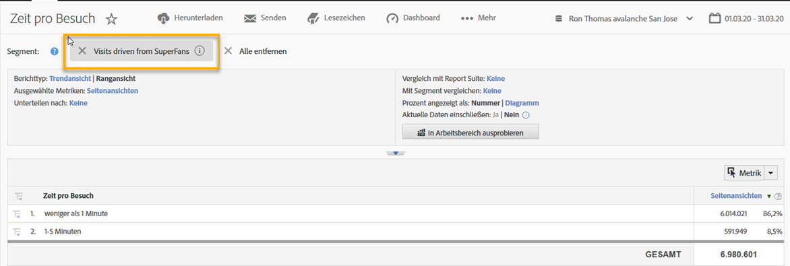
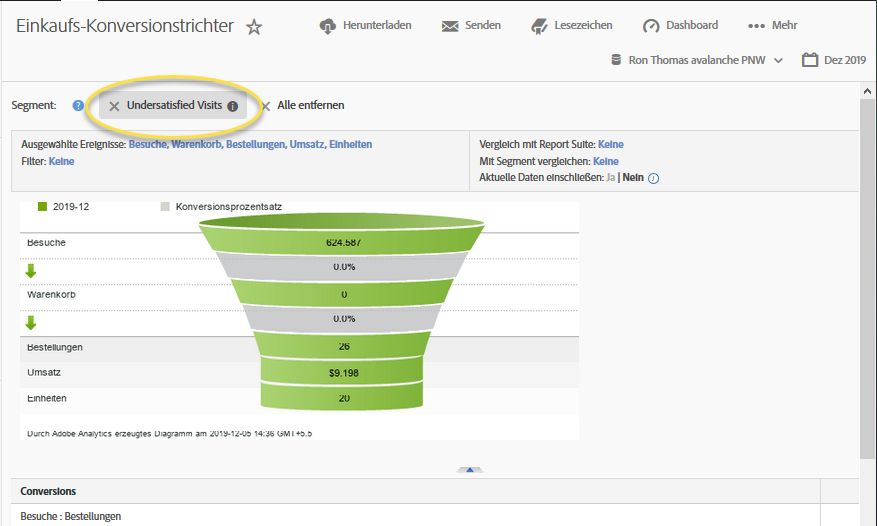

# Verwenden der Integration{#using-the-integration}

Nach Abschluss der Bereitstellung können Sie mit den zusätzlichen Funktionen dieser Integration beginnen.

>[!NOTE]
>
>Es kann bis zu 24 bis 48 Stunden dauern, bis Qualtrics-Antwortdaten innerhalb Ihrer Adobe Analytics-Berichterstellung angezeigt werden.

Im Folgenden werden Aktionen beschrieben, mit denen Sie aus Adobe Analytics Werte aus dieser Integration abrufen können.

1. Erstellen Sie ein Segment mit Umfrageantwortdaten (siehe [Segment erstellen](http://microsite.omniture.com/t2/help/en_US/sc/user/index.html?f=t_segment.html)).
1. Wenden Sie das Segment auf wichtige Berichte an.

## Beispiel {#section-07051d0d60a44408a4e108034586c42f}

Im Folgenden wird gezeigt, wie ein Analyst ein Adobe Analytics-Segment mit Umfrageantwortdaten definieren kann. In diesem Fall geht es bei einer Umfrage um eine Frage wie "Wie zufrieden waren Sie mit Ihrem aktuellen Besuch? « Mithilfe dieser Frage können wir ein Segment erstellen, um Besucher mit "Unzufrieden" zu identifizieren. Ein solches Segment könnte zum Drilldown in alle Adobe Analytics-Berichte verwendet werden - wie zum Beispiel den Einkaufsumrechnungstrichter, wie unten dargestellt.

 

