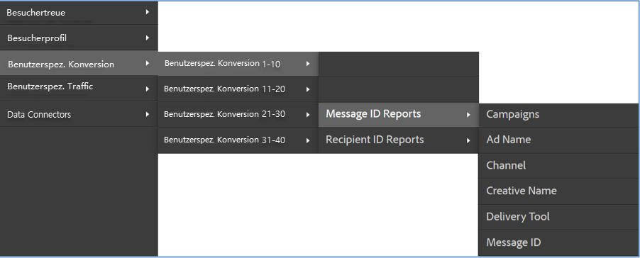

# Überprüfen der Integration {#verifying-the-integration}

Nach der Bereitstellung sollten Sie die folgenden Überprüfungen durchführen, um festzustellen, ob die Integration die Daten erfolgreich übertragen hat.

1. Anzeigen des Protokolls zu den Integrationsaktivitäten.
   1. Navigieren Sie in Adobe Experience Cloud zu **[!UICONTROL Support]** > **[!UICONTROL Protokoll zu den Integrationsaktivitäten]**.

      

   1. Suchen Sie nach Einträgen wie **[!UICONTROL Classification-Daten wurden erfolgreich importiert]**, **[!UICONTROL Metrikdaten wurden erfolgreich importiert]** und **[!UICONTROL Metrikdaten wurden erfolgreich exportiert]**. Diese Einträge sollten innerhalb 1 Tags nach erfolgreicher Bereitstellung angezeigt werden.
1. Zeigen Sie Ihre Berichtsdaten in Adobe Analytics an.

   1. Navigieren Sie zu **[!UICONTROL Benutzerspez. Konversion]** > **[!UICONTROL Benutzerspez. Konversion 1-10]** > **[!UICONTROL Nachrichten-ID-Berichte]**.

      

   1. Suchen Sie nach Responsys-Berichten. Diese Daten sollten innerhalb von 24–48 Stunden nach erfolgreicher Bereitstellung angezeigt werden.
