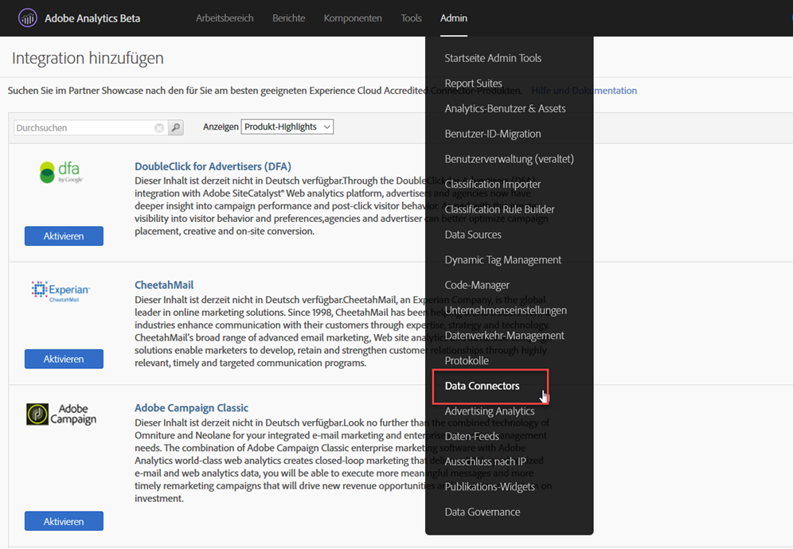
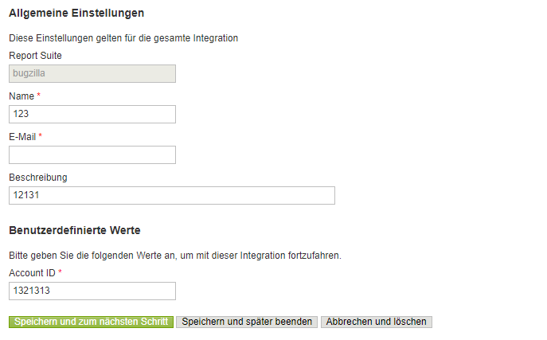
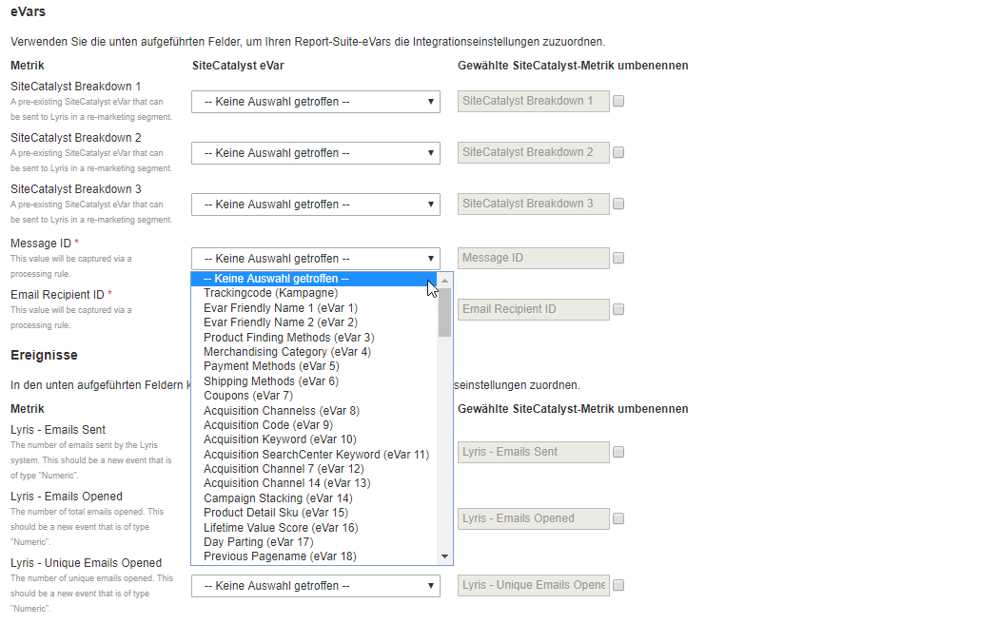
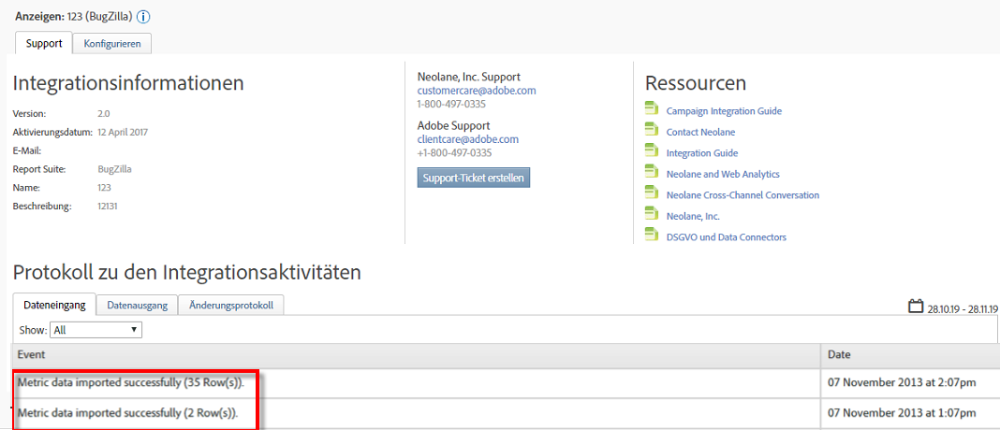

# Bereitstellen der Integration {#deploying-the-integration}

Die Bereitstellung dieser Integration erfolgt in 3 Schritten.

## Abschließen des Integrationsassistenten {#completing-the-integration-wizard}

Um die Integration zu aktivieren, müssen Sie den Selligent-Assistenten auf der Data Connectors-Oberfläche ausführen.

1. Navigieren Sie in der Adobe Experience Cloud zum Bereich „Data Connectors“.

   

1. Ziehen Sie unter **[!UICONTROL Integrationen hinzufügen]** das Selligent-Plug-in zu Adobe Experience Cloud.

   

   Dadurch wird die Data Connector-Integration für Selligent geöffnet.

1. **Integrationseinstellungen**: Wählen Sie die gewünschte Report Suite aus und geben Sie unter **[!UICONTROL Integrationseinstellungen]** einen Namen für die Integration ein.

1. Geben Sie unter **[!UICONTROL Benutzerdefinierte Werte]** alle Selligent-Konteninformationen ein.

   

1. **Variablenzuordnung**: Wählen Sie die entsprechenden reservierten eVars und Ereignisse aus den Dropdown-Menüs aus:

   

1. **Dateneinstellungen**: Abgesehen von den 3 automatisierten **[!UICONTROL Partner]**-Segmenten können Sie Ihre eigenen Segmente unter **[!UICONTROL Ihre Segmente]** auswählen.

1. Bei dieser Integration kann es sein, dass Sie einige Datenpunkte in Ihr Selligent-Konto herunterladen müssen. Unter der **[!UICONTROL Zugriffsanforderung]** können Sie Zugriff darauf gewähren.
1. Wählen Sie unter **[!UICONTROL Datenerfassung]** eine automatisierte oder manuelle Lösung (JavaScript-Plug-in) aus, um Abfragezeichenfolgenparameter aus der URL der Landingpage zu erfassen. Wenn Sie eine automatisierte Lösung auswählen, geben Sie den Abfragezeichenfolgenparameter für die Nachrichten-ID und die Empfänger-ID ein, also die MID bzw. RID. Wenden Sie sich für ein JavaScript-Plug-in an Ihren Adobe-Berater.
1. **Berichtseinstellungen**: Aktivieren Sie unter **[!UICONTROL Dashboard-Erstellung]** das Kontrollkästchen, damit das Selligent-Dashboard automatisch für Sie generiert wird.

   

1. Überprüfen Sie die Integrationszusammenfassung. Klicken Sie dann auf **[!UICONTROL Aktivieren]**.

## Konfiguration in Selligent {#configuration-within-selligent}

Sobald die Integration in Adobe Analytics aktiviert ist, wird eine automatische Konfiguration auf der Selligent-Seite aktiviert.

Es wurde ein Tracker erstellt, der jede E-Mail verfolgt. Falls Sie die Verfolgung auf eine bestimmte Domäne begrenzen möchten, sollten Sie die Tracker-Konfiguration entsprechend aktualisieren.

Wir empfehlen dringend, den Tracking-Parameter für Adobe Analytics in der URL nach vorne zu verschieben. Dadurch wird sichergestellt, dass die Adobe-Verarbeitungsregeln die Parameter aus der URL der Landingpage abrufen. Aktivieren Sie das Tracking, indem Sie das Kontrollkästchen wie unten gezeigt aktivieren.

## Überprüfen der Integration {#verifying-the-integration}

Nach Abschluss sämtlicher Implementierungsschritte können Sie überprüfen, ob die Integration die Daten erfolgreich übertragen hat.

Es dauert ein paar Tage, bis der Datenaustausch beginnt. Wenden Sie sich nach der Aktivierung der Integration an Selligent.

### Protokoll zu den Integrationsaktivitäten {#section-927e270495db479fba9578915d9ae9c9}

Navigieren Sie zu Ihrer Selligent-Integration in „Data Connectors“. Auf der Registerkarte **[!UICONTROL Support]** sollten Ereignisse wie „Metrikdaten wurden erfolgreich importiert“ bzw. „Classification-Daten wurden erfolgreich importiert“ angezeigt werden:

### Berichtsdaten {#section-ebd481a162324e66bd6dc8cb4b8d2424}

Zeigen Sie Ihre Selligent-Nachrichtenberichte mit den entsprechenden Metriken an.

1. Navigieren Sie in der Adobe Experience Cloud zu „Reports &amp; Analysen“.
1. Wählen Sie die gewünschte Report Suite aus.
1. Wählen Sie unter **[!UICONTROL Benutzerspez. Konversion]** die Option **[!UICONTROL Nachrichten-ID-Berichte]** und dann **[!UICONTROL Nachrichten-ID/Nachrichtenname]** aus.
