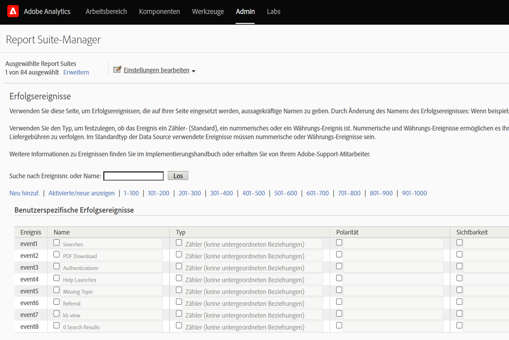
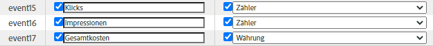
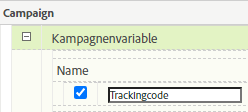
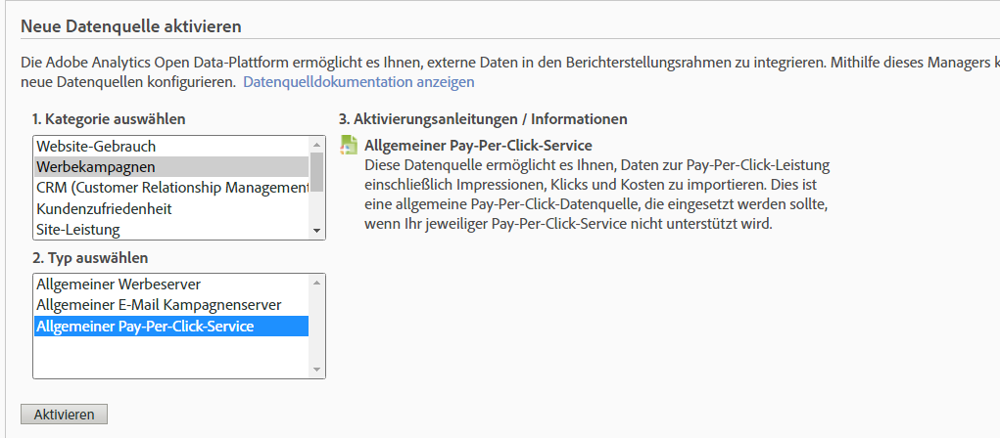
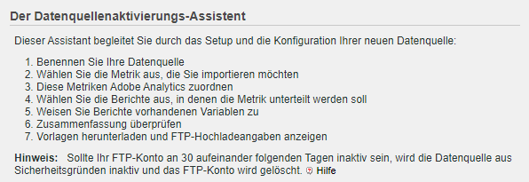
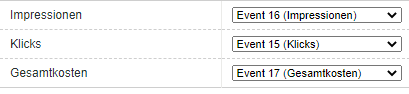
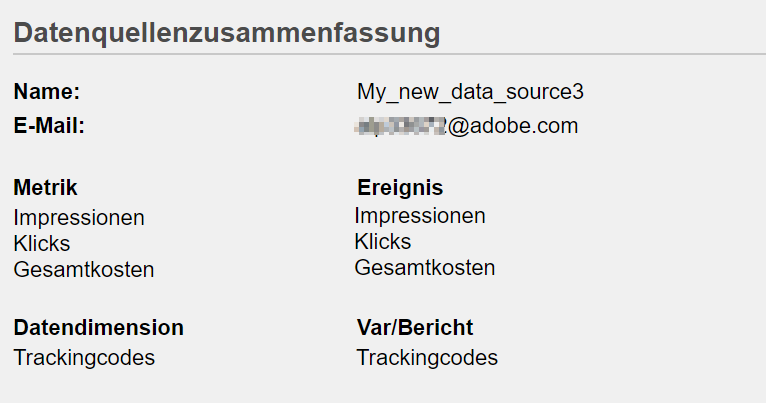
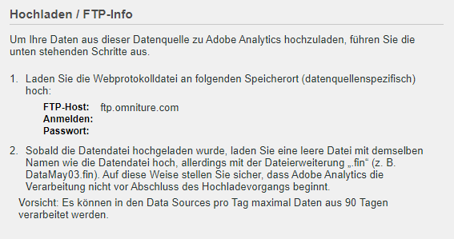

# Importieren [!UICONTROL gebührenpflichtiger Suchmetriken] mithilfe von [!UICONTROL Data Sources]

Für viele Marketingorganisationen ist die gebührenpflichtige Suche eine der wertvollsten und zuverlässigsten Methoden, um neue Kunden zu erreichen und bestehende zu behalten&#x200B;. Die [!UICONTROL Data Sources] -Funktion in Adobe Analytics erleichtert den Import von erweiterten gebührenpflichtigen Suchdaten aus digitalen Werbeanzeigen wie Google AdWords. Sie können diese Daten zusammen mit den Verhaltensdaten und Kundenattributen auf der Site in die übrigen Marketingdaten integrieren, um bessere Einblicke in die gebührenpflichtigen Suchbemühungen Ihres Unternehmens zu erhalten.

Diese Schritte zeigen Ihnen, wie Sie eine Integration mit AdWords konfigurieren, um Suchbegriffdaten sowie Metriken wie Impressionen, Klicks, Kosten pro Klick und mehr zu importieren.

In den Schritten wird beschrieben, wie Sie einen einmaligen Import von Pay-per-Click-Daten einrichten. Die [!UICONTROL Datenquellen] ermöglichen jedoch den kontinuierlichen Import von Daten unter Verwendung des hier beschriebenen Dateiformats. Abhängig von Ihrer gebührenpflichtigen Suchplattform können Sie regelmäßige Exporte planen (täglich, monatlich usw.), automatisierte Prozesse einrichten, um diese Exporte in das von Adobe Analytics benötigte Dateiformat zu transformieren, und diese Dateien für den Berichte der gebührenpflichtigen Suchintegration in Adobe Analytics hochladen.

## Voraussetzungen

* Sie haben die Erkennung gebührenpflichtiger Suchen implementiert.
* Sie erfassen Verfolgungscodedaten.
* Sie haben eindeutige Rückverfolgungscodes für jede Anzeigengruppe.

## Configure [!UICONTROL Success Events]

Unser erster Schritt besteht darin, Adobe Analytics auf den Empfang der Metriken vorzubereiten. Dazu müssen Sie einige Erfolgsereignisse einrichten.

[!UICONTROL Erfolgsereignisse sind Aktionen, die verfolgt werden können. ] You determine what a [!UICONTROL success event] is. Zur Verfolgung von [!UICONTROL gebührenpflichtigen Suchmetriken] möchten wir [!UICONTROL Erfolgsmetriken] für [!UICONTROL Klicks], [!UICONTROL Impressionen], [!UICONTROL Gesamtkosten] und EreignisAktivieren vonRückverfolgungscodes einrichten.

1. Go to **[!UICONTROL Adobe Analytics > Admin > Report Suites]**.
1. Wählen Sie eine Report Suite aus.
1. Klicken Sie auf **[!UICONTROL Einstellungen bearbeiten > Konversion > Erfolgsereignisse]**.

   

1. Verwenden Sie unter Benutzerdefinierte Erfolgsereignisse **[!UICONTROL Hinzufügen Neu]** , um 3 benutzerspezifische Erfolgserfolg-Ereignis zu erstellen: [!UICONTROL Klicks] (Zähler), [!UICONTROL Impressionen] (Zähler) und [!UICONTROL Gesamtkosten] (Währung).

   

1. Klicken Sie auf „Speichern“.
Sie sollten eine Meldung erhalten, dass Ihre Speichern genehmigt wurden.
1. Navigieren Sie zu **[!UICONTROL Admin > Report Suites > Einstellungen bearbeiten > Konversion > Konversionsvariablen]**.
1. Aktivieren Sie Trackingcodes, indem Sie das Kontrollkästchen neben **[!UICONTROL Trackingcode]** unter **[!UICONTROL Kampagne > Kampagne-Variable]** aktivieren.

   

## Data Sources einrichten

[!UICONTROL Mit Data Sources] können Sie Nicht-Clickstream-Daten für Adobe Analytics freigeben. In diesem Fall verwenden wir Adobe Analytics zur Verfolgung von Metriken für gebührenpflichtige Suchen. Wir verwenden den Rückverfolgungscode als unseren Schlüssel, um die beiden Datenelemente - gebührenpflichtige Suchmetriken und Adobe Analytics-Metriken - miteinander zu verbinden.

1. Navigieren Sie zu **[!UICONTROL Adobe Analytics > Admin > Data Sources]**.
1. Klicken Sie auf die Registerkarte **[!UICONTROL Erstellen]** , um den Beginn zum Aktivieren neuer Datenquellen zu aktivieren.
1. Wählen Sie unter **[!UICONTROL Kategorie]** auswählen die Option **[!UICONTROL AnzeigenKampagne]**.

   

1. Wählen Sie unter **[!UICONTROL Typ]** auswählen die Option **[!UICONTROL Allgemeiner Pay-per-Click-Dienst]**.
1. Klicken Sie auf **[!UICONTROL Aktivieren]**.
The [!UICONTROL Data Source Activation Wizard] displays:

   

1. Klicken Sie auf **[!UICONTROL Weiter]** und geben Sie der Datenquelle einen Namen. Dieser Name wird im Datenquellen-Manager angezeigt.
1. Akzeptieren Sie die Dienstvereinbarung und klicken Sie auf **[!UICONTROL Weiter]**.
1. Wählen Sie die drei Standardmetriken aus: [!UICONTROL Impressionen], [!UICONTROL Klicks] und [!UICONTROL Gesamtkosten] und klicken Sie auf **[!UICONTROL Weiter]**.
1. Jetzt &quot;ordnen&quot; Sie diese neue Datenquelle den benutzerspezifischen Ereignissen zu, die wir unter [Ereignis](/help/admin/admin/c-success-events/t-success-events.md)zum Konfigurieren von Erfolgen erstellt haben.

   

1. Wählen Sie die DatendimensionenAktivieren Sie das Kontrollkästchen neben Rückverfolgungscodes und klicken Sie auf **[!UICONTROL Weiter]**.
1. Ordnen Sie Daten-Dimensionen zu.
Ordnen Sie die Dimension der importierten Daten (Attribut) dem Adobe Analytics-Attribut zu, in dem Sie sie speichern möchten. Dies kann eine Standarddimension oder ein eVar sein. Nachdem Sie auf **[!UICONTROL Weiter]** geklickt haben, werden die resultierenden Zuordnungen in der Zusammenfassung angezeigt:

   

1. Klicken Sie auf **[!UICONTROL Speichern]**.
1. Klicken Sie auf **[!UICONTROL Herunterladen]** , um die Vorlagendatei für diese Datenquelle herunterzuladen.
Der Dateiname entspricht dem ursprünglich angegebenen Datenquellentyp - in diesem Fall &quot;Generic Pay-per-Click Service template.txt&quot;.
1. Öffnen Sie die Vorlage in Ihrem bevorzugten Texteditor.
Die Datei ist bereits mit den Metriken und Dimensionen sowie deren Zuordnungen gefüllt.

## Exportieren von PPC-Daten und Hochladen in Analytics

In ähnlicher Weise durchgeführte Schritte für Google Adwords, MSN, Yahoo und andere PPC-Konten.

### Exportieren von Daten

1. Melden Sie sich bei Ihrem PPC-Konto an und erstellen Sie einen neuen Bericht oder Export.
Stellen Sie sicher, dass der Export die folgenden Felder enthält: Datum, Ziel-URL (Landingpage), Impressionen, Klicks und Kosten. Der Export kann andere Felder enthalten, aber Sie löschen sie wie unten beschrieben.
1. Speichern Sie den Bericht nach Möglichkeit als `.csv` oder tabulatorbegrenzte Datei. Dies erleichtert die Arbeit in den folgenden Schritten.
1. Öffnen Sie die Datei in Microsoft Excel.

### Datei in Microsoft Excel bearbeiten

1. Löschen Sie in Microsoft Excel alle Spalten, die nicht oben aufgeführt sind.
1. Löschen Sie alle zusätzlichen Zeilen oben.
1. So isolieren Sie die Rückverfolgungscodes von den Ziel-URLs:
a. Kopieren Sie Daten aus allen Spalten und fügen Sie sie ein.
b. Klicken Sie auf **[!UICONTROL Daten > Text in Spalten]**.
c. Stellen Sie in Schritt 1 des Assistenten sicher, dass **[!UICONTROL Getrennt]** ausgewählt ist, und klicken Sie auf **[!UICONTROL Weiter]**.
d. Geben Sie in Schritt 2 des Assistenten das Trennzeichen an, je nachdem, wie Sie Ihre URLs erstellt haben (entweder ? oder &amp;) und klicken Sie auf **[!UICONTROL Weiter]**.
e. Vorschau der Daten in Schritt 3 des Assistenten und stellen Sie sicher, dass eine der Spalten &quot;trackingcodename=trackingcode&quot;lautet. Wenn Sie zusätzliche Variablen haben, wiederholen Sie diese Schritte (mit &amp; als Trennzeichen).
f. Löschen Sie alle Spalten mit Ausnahme von Trackingcodes, Impressionen, Klicks und Kosten. hinzufügen Sie eine neue Spalte mit dem Namen Datum und ordnen Sie die Spalten in der folgenden Reihenfolge an: Datum: Rückverfolgungscode: Impressionen: Klicks: Kosten.
1. hinzufügen Sie diese Daten auf die Vorlage, die Sie oben im Abschnitt &quot;Einrichten der Datenquellen&quot;heruntergeladen haben.
Jetzt können Sie die Datei hochladen.

### Hochladen der Datei über FTP auf Adobe Analytics

Gehen Sie zurück zum Datenquellen-Assistenten, um Anweisungen zu erhalten und laden Sie die Datei via FTP hoch:

## Errechnete Metriken erstellen

Das Hinzufügen errechneter Metriken ist bei Pay-per-Click-Entscheidungen hilfreich.

Sie könnten beispielsweise folgende [errechnete Metriken](https://experienceleague.adobe.com/docs/analytics/components/calculated-metrics/calcmetric-workflow/cm-build-metrics.html?lang=en#calculated-metrics)hinzufügen:

| Name | Formel | Metriktyp | Beschreibung |
| --- | --- | --- | --- |
| Seitenansichten pro Besuch | Seitenansichten/Besuche | Numerisch | Wenn auf Site-Ebene angewandt: Zeigt die durchschnittliche Anzahl von Seiten pro Besuch. Wenn im Bericht „Bevorzugte Seiten“ angewandt: Zeigt, wie oft eine bestimmte Seite im Durchschnitt pro Besuch angezeigt wird. |
| Durchschnittlicher Bestellwert | Umsatz/Bestellungen | Währung | Zeigt den durchschnittlichen Umsatz pro Bestellung. |
| Umsatz pro Besuch | Umsatz/Besuch | Währung | Zeigt den durchschnittlichen Umsatz pro Besuch. |
| Durchklickrate (CTR) | Klicks/Impressionen | Numerisch | Messen Sie das Verhältnis von Klicks zu Impressionen einer Online-Werbeanzeige oder E-Mail-Marketing-Kampagne. |
| Gewinn | Umsatz - Kosten | Währung | Zeigt den Umsatz einer Kampagne abzüglich der Kosten an. |
| Gewinn pro Impression (PPI) | (Umsatz - Kosten)/Impression | Währung | Zeigt, wie viel Umsatz jedes Mal generiert wurde, wenn eine Anzeige angezeigt wurde, im Verhältnis zu den Kosten. |
| ROAS (Return on Ad Spend) | Verkaufsbetrag/Werbeausgaben | Währung | (ROI) Stellt die Dollar dar, die pro ausgegebenem Dollar für die entsprechende Werbung ausgegeben werden. |

## Konfigurieren und Ausführen von Berichten

Der letzte Schritt besteht darin, die Datenquellenmetriken und errechneten Metriken zum Bericht Rückverfolgungscode hinzuzufügen und einen Drilldown in eine Kampagne durchzuführen, um eine sofortige Ansicht der Leistung der einzelnen Anzeigengruppen zu erhalten.

1. Wählen Sie unter **[!UICONTROL Adobe Analytics > Berichte]** die Report Suite aus, in die Sie Datenquellen importiert haben.
1. Navigieren Sie zu **[!UICONTROL Berichte > Kampagnen > Rückverfolgungscode > Rückverfolgungscode]**.
1. Wählen Sie den Datumsbereich aus.
1. Klicken Sie auf **[!UICONTROL Metriken > Hinzufügen]** und fügen Sie Ihre Datenquellen-Metriken (Klicks, Impressionen, Gesamtkosten) aus der Liste der Standardmetriken hinzu.
1. Führen Sie die gleichen Schritte für alle berechneten Metriken durch, die Sie hinzugefügt haben. Der Bericht wird aktualisiert, wenn Sie Metriken hinzufügen.
