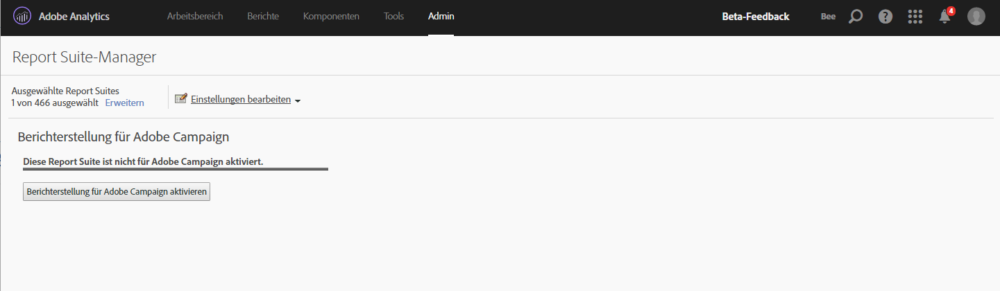

# Berichterstellung für Adobe Campaign

Weitere Informationen zum Konfigurieren dieser Integrationen finden Sie in der [Adobe Campaign-Dokumentation](https://helpx.adobe.com/de/campaign/standard/integrating/using/about-campaign-analytics-integration.html)

Mithilfe dieser Integration zwischen Adobe Analytics und Adobe Campaign

* können Sie Ihre KPI (Key Performance Indicator)-Daten aus Adobe Campaign Standard in Adobe Analytics freigeben.
* werden Verfolgungsformeln mit Adobe Analytics-Parametern erweitert.
* wird unter **[!UICONTROL Analytics]** > **[!UICONTROL Berichte]** > **[!UICONTROL Adobe Campaign]** ein neuer Bericht hinzugefügt.
* werden 5 neue Adobe Campaign-Klassifizierungen hinzugefügt.
* werden 10 neue Adobe Campaign-Metriken hinzugefügt.
* werden 6 neue Adobe Campaign-Dimensionen hinzugefügt.
* werden Daten alle 15 Minuten mit Analytics synchronisiert.

## Schritt 1. Aktivieren der Berichterstellung für Adobe Campaign {#section_C685EF10505045708A6536BB13F6CD58}

Wenn Sie Campaign-Daten in Analytics anzeigen möchten, müssen Sie zunächst Campaign-Berichte aktivieren.

1. Navigieren Sie zu **[!UICONTROL Analytics]** > **[!UICONTROL Admin]** > **[!UICONTROL Report Suites]** > **`<select report suite>`** > **[!UICONTROL Einstellungen bearbeiten]** > **[!UICONTROL Adobe Campaign]** > **[!UICONTROL Berichterstellung für Adobe Campaign]** .
1. Klicken Sie auf **[!UICONTROL Berichterstellung für Campaign aktivieren]**.

   

## Schritt 2. Anzeigen von Adobe Campaign-Berichten {#section_9C18A29F3CC54BD4AC5EA96417F17B33}

Durch die Integration zwischen Adobe Campaign Standard und Adobe Analytics wird die folgende Berichtsnummer unter **[!UICONTROL Analytics]** > **[!UICONTROL Berichte]** hinzugefügt.

| Bericht | Definition |
|--- |--- |
| Adobe Campaign – ID der ausgeführten Bereitstellung | Zeigt aus Adobe Campaign importierte Daten über E-Mails an, die in Adobe Campaign gesendet wurden. |

## Schritt 3. Adobe Campaign Classifications {#section_74A28AF3F4CA4091943789DE4D8B2B63}

**[!UICONTROL Analytics]** > **[!UICONTROL Admin]** > **[!UICONTROL Report Suites]** > **`<select report suite>`** > **[!UICONTROL Einstellungen bearbeiten]** > **[!UICONTROL Adobe Campaign]** > **[!UICONTROL Adobe Campaign Classifications]**

Nach der Aktivierung der Report Suite für Adobe Campaign sind die folgenden Klassifizierungen verfügbar:

* Bereitstellungs-ID (in Campaign angezeigter, interner Bereitstellungsname)
* Bereitstellungsbezeichnung (Bereitstellung in Campaign – Individuelle Bereitstellung/Periodische Bereitstellung/Transaktionsbereitstellung)
* Kampagnen-ID (in Campaign angezeigter, interner Kampagnenname)
* Bereitstellungsbezeichnung (Campaign in Adobe Campaign)
* Ausgeführte Bereitstellungsbezeichnung (Liste der individuellen ausgeführten Bereitstellungen)

## In Adobe Analytics verfügbare Adobe Campaign-Dimensionen und -Metriken  {#section_F33385C9660644AF84172EC39601469B}

Die folgenden **Metriken** sind in Campaign der Adobe Analytics Report Suites verfügbar:

* Adobe Campaign – Gesendet
* Adobe Campaign – Geöffnet
* Adobe Campaign – Geklickt
* Adobe Campaign – Verarbeitet
* Adobe Campaign – Geliefert
* Adobe Campaign – Einmalige Öffnung
* Adobe Campaign – Einmaliger Klick
* Adobe Campaign – Abonnement beendet
* Adobe Campaign – Rücksendungen insgesamt
* Adobe Campaign – Instanzen für ID der ausgeführten Bereitstellung

Die folgenden **Dimensionen** sind in Campaign der Adobe Analytics Report Suites verfügbar:

| Name der Dimension | Definition |
|--- |--- |
| Kampagnen-ID | ID aller Kampagnen, für die während der Dauer KPIs gesendet wurden. |
| Kampagnenbezeichnung | Bezeichnungen der Kampagnen-IDs |
| Bereitstellungs-ID | ID aller Bereitstellungen, für die während der Dauer KPIs gesendet wurden. Beinhaltet zudem die IDs von Master-Bereitstellungen für periodische Bereitstellungen und Transaktionsbereitstellungen. Beispiel: Eine periodische Bereitstellung DM1 wurde geplant und DM2, DM3, DM4 und DM5 waren untergeordnete Bereitstellungen der periodischen Bereitstellung.  Die Bereitstellungs-ID zeigt Ergebnisse für alle Bereitstellungen von DM1 bis DM5 an. |
| Versandtitel | Bezeichnungen der Bereitstellungs-IDs |
| ID der ausgeführten Bereitstellung | IDs von nur ausgeführten Bereitstellungen. Keine ID einer periodischen/transaktionsbezogenen Master-Bereitstellung. Beispiel: Eine periodische Bereitstellung DM1 wurde geplant und DM2, DM3, DM4 und DM5 waren untergeordnete Bereitstellungen der periodischen Bereitstellung. Die ausgeführte Bereitstellungs-ID zeigt Ergebnisse für alle Bereitstellungen von DM2 bis DM5 an – dies sind die tatsächlich ausgeführten Bereitstellungen. |
| Bezeichnung der ausgeführten Bereitstellung | Bezeichnungen der ausgeführten Bereitstellungs-IDs |
