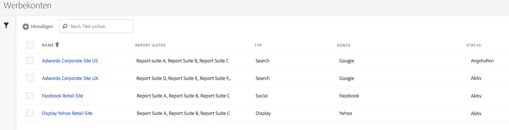
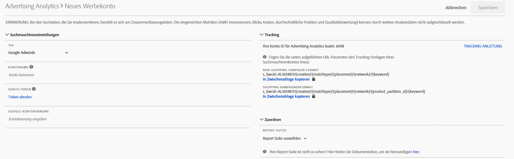

# Werbekonto einrichten

Adobe Analytics-Administratoren können neue Werbekonten erstellen und mehrere Konten verschiedenen Report Suites zuordnen (1:1, 1:n, n:n).

Administratoren können auch [Nicht-Administratoren Zugriff gewähren](/help/integrate/c-advertising-analytics/overview.md#section_FCC58EB635954A32990D4E67B52B4369), damit sie Werbekonten einrichten können.

1. Navigieren Sie in Adobe Analytics zu **[!UICONTROL Admin]** > **[!UICONTROL Werbekonten]**.
1. (Nur bei erster Verwendung) Akzeptieren Sie die Bedingungen der Endnutzer-Lizenzvereinbarung.
1. Klicken Sie auf **[!UICONTROL + Hinzufügen]**.
1. Das Dialogfeld [!UICONTROL Neues Suchmaschinenkonto] wird angezeigt:

   

1. Legen Sie die **[!UICONTROL Suchmaschineneinstellungen]** gemäß folgenden Richtlinien fest:

   <table id="table_B3BE66B7D4C54766B8FFD2C6DCD657AF"> 
    <thead> 
      <tr> 
      <th colname="col1" class="entry"> Einstellung </th> 
      <th colname="col2" class="entry"> Beschreibung </th> 
      </tr>
    </thead>
    <tbody> 
      <tr> 
      <td colname="col1"> 
Typ 
 </td> 
      <td colname="col2"> 
Sie haben zwei Möglichkeiten: Google AdWords und Microsoft Bing. 
 
Hinweis: Yahoo Gemini wurde am 31. März 2019 von Microsoft Bing übernommen. Daher ist die Anzeigen-Kontenoption „Yahoo Gemini“ nicht mehr verfügbar.  
 </td> 
      </tr> 
      <tr> 
      <td colname="col1"> 
Kontoname 
 </td> 
      <td colname="col2"> 
Sie können einen beliebigen Kontonamen festlegen. Dieser Name wird später in der Benutzeroberfläche angezeigt. 
 </td> 
      </tr> 
      <tr> 
      <td colname="col1"> 
OAuth-Token 
 </td> 
      <td colname="col2"> 
Hinweis: Bei OAuth handelt es sich um einen offenen Zugriffsstandard, der häufig eingesetzt wird, um Websites oder Anwendungen Zugang zu Informationen auf anderen Websites zu bieten, ohne hierzu Passwörter preiszugeben. 
 
Hinweis: Hierbei werden Sie an eine Drittanbieter-URL (efrontier.com) umgeleitet. Adobe nutzt efrontier, um den OAuth-Authentifizierungsprozess für alle drei Suchmaschinen zu verarbeiten. 
 
Hinweis: Wenn Sie Internet Explorer 11 (oder niedriger) verwenden, können Sie für keine der drei Suchmaschinen das OAuth-Token abrufen. Verwenden Sie stattdessen einen anderen Webbrowser. 
 
Wenn Sie auf Token abrufen klicken, wird der OAuth2-Authentifizierungsprozess gestartet. Sie werden daraufhin aufgefordert, sich mit Ihren Anmeldedaten bei Ihrem Google- oder Bing-Suchkonto anzumelden. Je nach ausgewählter Suchmaschine unterscheidet sich der Prozess leicht: 

      <ul id="ul_FC9B5612F6554495B04C357CB0AB72EB"> 
       <li id="li_CD54231BFF134F83B3B5B14B34A0E1D2">Google AdWords: Geben Sie die Google-Konto-ID an. </li> 
       <li id="li_89B9D54BAA914E5DB2959B193489582E">Microsoft Bing: Geben Sie die Bing-Konto-ID und die Bing-Kunden-ID an. </li> 
       </ul> 
Weitere Informationen finden Sie unter <a href="/help/integrate/c-advertising-analytics/c-adanalytics-workflow/aa-locate-account-id.md"  > Finden Sie Ihre Konto-ID</a>. 
 
Sobald Sie sich erfolgreich angemeldet haben, wird im OAuth-Token-Feld <code>Retrieved</code>. 
 </td> 
      </tr> 
    </tbody> 
    </table>

1. Geben Sie im Abschnitt **[!UICONTROL Tracking]** Informationen dazu ein, wie die Suchmaschine von Ihrer Adobe Analytics-Implementierung verfolgt wird. Dieser Schritt ist erforderlich, um die Adobe Analytics-Daten ordnungsgemäß mit den Suchmaschinendaten zu ergänzen.
Legen Sie die **[!UICONTROL Tracking-Einstellungen]** gemäß folgenden Richtlinien fest:

   | Einstellung | Beschreibung |
   |--- |--- |
   | Typ | <ul><li>**Auto**: Hier entscheidet die Advertising Cloud-Engine, wie die Tracking-Parameter an die Tracking-Vorlagen/Ziel-URLs der Suchmaschine angehängt werden. Dies ist der einfachste Ansatz, der jedoch möglicherweise nicht zum besten integrierten Datensatz führt. **Wichtig:** Um ein Suchmaschinenkonto im Auto-Modus zu konfigurieren, müssen Sie die folgenden Aktionen ausführen: - Der Parameter „s_kwcid“ und der Wert werden den Konto-Tracking-Vorlagen oder Landingpages-URLs im hinzugefügten Konto hinzugefügt. Die Einfügung erfolgt am Ende der URL. Daher können zusätzliche Maßnahmen von Ihrer Seite erforderlich sein, wenn Ihr Webserver ein bestimmtes „key=value“-Paar am Ende der URL ODER ein Update zur Unterstützung eines neuen „key=value“-Paares in der URL erfordert. **Hinweis:** Erfahren Sie mehr darüber, ob Sie diesen Parameter zu Ihrer [Richtlinie zur Inhaltssicherheit](https://docs.adobe.com/content/help/de-DE/id-service/using/reference/csp.html) hinzufügen sollten. - Darüber hinaus können Keywords als Teil des Wertes „s_kwcid“ in die Landingpage-URL eingefügt werden. Wenn sie Sonderzeichen oder Symbole enthalten, überprüfen Sie daher, ob Ihr Webserver diese Zeichen unterstützen kann. (Ein häufig verwendetes Sonderzeichen ist beispielsweise „+“, das in „Broad Match Modified“-Keywords verwendet wird.)</li><li>**Manuell**: Hierüber können Sie verwalten, wie Tracking-Parameter zu den Tracking-Vorlagen/Ziel-URLs der Suchmaschine hinzugefügt werden. [Weitere Informationen finden Sie in den Beispielen für manuelles Tracking für die einzelnen Suchmaschinen](/help/integrate/c-advertising-analytics/c-adanalytics-workflow/aa-manual-vs-automatic-tracking.md).</li></ul> |

1. Wählen Sie im Abschnitt **[!UICONTROL Zuordnung]** aus, welche Report Suite(s) mit diesem Suchmaschinenkonto verknüpft werden soll(en). Sie müssen mindestens eine Report Suite angeben, bevor Sie das Werbekonto speichern können. Sie können mehrere Konten verschiedenen Report Suites zuordnen (1:1, 1:n, n:n). Beachten Sie, dass die Daten, die AMO aus der Suchmaschine abruft, einfach in die zugeordnete Report Suite kopiert werden. Die Daten werden also nicht aufgeteilt.

   >[!IMPORTANT]
   >
   >Nur Report Suites, die [einer Experience Cloud-Organisation zugeordnet sind](https://docs.adobe.com/content/help/de-DE/core-services/interface/about-core-services/report-suite-mapping.html), stehen zur Auswahl zur Verfügung. Wenn Ihre Report Suite nicht aufgeführt ist, suchen Sie im Abschnitt [Problembehebung in Advertising Analytics](/help/integrate/c-advertising-analytics/c-adanalytics-workflow/aa-troubleshooting.md) nach weiteren Informationen.

   Legen Sie die **[!UICONTROL Zuordnungseinstellungen]** gemäß folgenden Richtlinien fest:

   <table id="table_AF876DC40F97403882C0AA528BD204FF"> 
    <thead> 
      <tr> 
      <th colname="col1" class="entry"> Einstellung </th> 
      <th colname="col2" class="entry"> Beschreibung </th> 
      </tr>
    </thead>
    <tbody> 
      <tr> 
      <td colname="col1"> 
Report Suite  Zuordnen 
 </td> 
      <td colname="col2"> 
Die Report-Suite-Zuordnung bestimmt die Report Suite, die mit diesem Suchmaschinenkonto verknüpft werden soll. Anders ausgedrückt: Sie bestimmt, an welche Report Suite(s) die Daten der Suchmaschine gesendet werden. 
 
Wenn Ihre Report Suite nicht aufgeführt ist, können Sie sie mit diesem Tool <a href="https://docs.adobe.com/content/help/de-DE/core-services/interface/about-core-services/report-suite-mapping.html"  >einer Experience Cloud-Organisation zuordnen</a>. 
 </td> 
      </tr> 
    </tbody> 
    </table>

1. Klicken Sie auf **[!UICONTROL Speichern]**.
1. Nachdem Sie auf „Speichern“ geklickt haben, wird ein Haftungsausschluss mit einer Reihe von Hinweisen angezeigt. Sie werden dazu aufgefordert zu bestätigen, dass Sie die Vereinbarung gelesen und verstanden haben. Aktivieren Sie das Kontrollkästchen und klicken Sie auf **[!UICONTROL OK]**.

   Nun wird die [Verwaltungsoberfläche](/help/integrate/c-advertising-analytics/c-adanalytics-workflow/aa-manage-ad-accounts.md) für Werbekonten angezeigt, in der das neu erstellte Konto aufgeführt sein sollte.

>[!NOTE]
>
>Es dauert in der Regel mindestens 24 Stunden, bis Suchmaschinendaten in Ihren Analytics-Berichten angezeigt werden.

