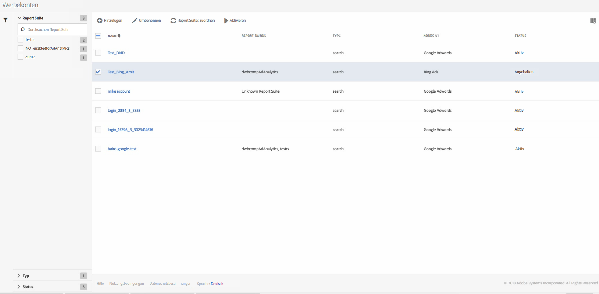

# Verwalten von Werbekonten

You can access the Management UI by navigating to **[!UICONTROL Admin]** &gt; **[!UICONTROL Advertising Accounts]**.

<table id="table_BE318026CF024E94A885EED86AA7077F"> 
 <thead> 
  <tr> 
   <th colname="col1" class="entry"> Element </th> 
   <th colname="col2" class="entry"> Definition </th> 
  </tr>
 </thead>
 <tbody> 
  <tr> 
   <td colname="col1"> 
<b>Aktionen</b> 
 </td> 
   <td colname="col2"> 
<b>Hinweis: Aktionen werden nur angezeigt, wenn Sie mindestens ein Werbekonto ausgewählt haben. </b> 
 </td> 
  </tr> 
  <tr> 
   <td colname="col1"> 
+ Hinzufügen 
 </td> 
   <td colname="col2"> 
Hierdurch gelangen Sie zur Benutzeroberfläche <a href="../../../integrate/c-advertising-analytics/c-adanalytics-workflow/aa-create-ad-account.md#concept_1958E8C15C334E8B9DC510EC8D5DCA7C" format="dita" scope="local">Werbekonto einrichten</a>. 
 </td> 
  </tr> 
  <tr> 
   <td colname="col1"> 
Umbenennen 
 </td> 
   <td colname="col2"> 
Benennt dieses Konto in allen Report Suites um, denen es zugeordnet ist. 
 </td> 
  </tr> 
  <tr> 
   <td colname="col1"> 
Report Suites zuordnen 
 </td> 
   <td colname="col2"> 
Hierüber können Sie die Report Suite-Zuordnungen bearbeiten. 
 </td> 
  </tr> 
  <tr> 
   <td colname="col1"> 
Anhalten 
 </td> 
   <td colname="col2"> 
Deaktiviert das Konto. Um es wieder zu aktivieren, klicken Sie auf Aktivieren. 
 </td> 
  </tr> 
  <tr> 
   <td colname="col1"> 
<b>Spaltenüberschriften</b> 
 </td> 
   <td colname="col2"> </td> 
  </tr> 
  <tr> 
   <td colname="col1"> 
Name 
 </td> 
   <td colname="col2"> 
Der Name, den Sie diesem Werbekonto zugewiesen haben. 
 </td> 
  </tr> 
  <tr> 
   <td colname="col1"> 
Report Suites 
 </td> 
   <td colname="col2"> 
Die Report Suite(s), die Sie diesem Werbekonto zugeordnet haben. 
 </td> 
  </tr> 
  <tr> 
   <td colname="col1"> 
Typ 
 </td> 
   <td colname="col2"> 
Aktuell wird nur folgender Typ unterstützt: Suche. 
 </td> 
  </tr> 
  <tr> 
   <td colname="col1"> 
Konto 
 </td> 
   <td colname="col2"> 
Führt eines der zwei unterstützten Kontotypen auf: Google Adwords oder Bing Ads. 
 </td> 
  </tr> 
  <tr> 
   <td colname="col1"> 
Status 
 </td> 
   <td colname="col2"> 
Es gibt zwei Statusanzeigen: 
 
    <ul id="ul_376263DEF6EE44B48564D272D3CBFCBC"> 
     <li id="li_75E329B68B4D4E929E227E717C993082"><b>Aktiv</b>: Das Konto ruft aktiv Suchdaten ab. </li> 
     <li id="li_5E2DF98B22D34437A2A2C93F996C1EA2"><b>Angehalten</b>: Das Konto ist derzeit deaktiviert und ruft keine Suchdaten ab. </li> 
    </ul> </td> 
  </tr> 
  <tr> 
   <td colname="col1"> 
<b>Filter</b> 
 </td> 
   <td colname="col2"> 
(Linker Rand) Sie können die Werbekonten nach Report Suite, Typ und Status filtern. 
 </td> 
  </tr> 
 </tbody> 
</table>

