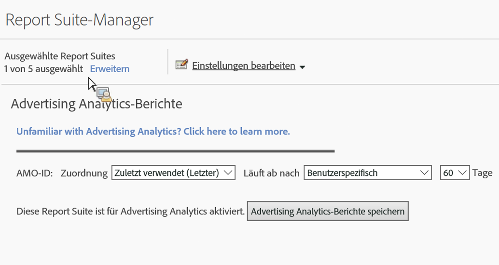

# Report Suite für Advertising Analytics aktivieren

Um alle Advertising Analytics-Suchdaten in Analytics anzeigen zu können, müssen Sie jede einzelne Experience Cloud-zugeordnete Report Suite für Advertising Analytics-Berichte konfigurieren.

1. [Ordnen Sie Ihre Report Suite einer Organisation zu.](https://marketing.adobe.com/resources/help/en_US/mcloud/map-report-suite.html)
1. Navigate to **[!UICONTROL Admin]** &gt; **[!UICONTROL Report Suites]**.

1. Select the report suite that is [mapped to your Experience Cloud organization](https://marketing.adobe.com/resources/help/en_US/mcloud/map-report-suite.html).
1. Click **[!UICONTROL Edit Settings]** &gt; **[!UICONTROL Advertising Analytics Configuration]**.

   

   >[!IMPORTANT]
   >
   >Die AMO-ID bezieht sich auf die Adobe Advertising Cloud-Variable, in die die Suchdaten eingefügt werden.

1. Legen Sie die Variablenzuordnung und die Gültigkeitsdauer für die AMO-ID-Variable fest. Konversionsvariablen (eVars) ermöglichen es Adobe Analytics, Erfolgsereignisse spezifischen Variablenwerten zuzuordnen. Manchmal weisen Variablen mehrere Werte auf, bevor sich ein Erfolgsereignis einstellt. In diesen Fällen wird durch die Zuordnung festgelegt, auf welchen Variablenwert das Ereignis zurückgeführt wird.

   | Einstellung | Definition |
   |--- |--- |
   | Ausgangswert (Erster) | Das Ereignis wird vollständig dem ersten angezeigten Wert zugeordnet, unabhängig davon, welche Werte die Variable in Folge annimmt. |
   | Zuletzt verwendet (Letzter) | Das Erfolgsereignis wird vollständig dem letzten angezeigten Wert zugeordnet, unabhängig davon, welche Variablen zuvor vorhanden waren. |
   | Läuft ab nach | Hier wird ein Zeitraum bzw. ein Ereignis angegeben, nachdem der eVar-Wert abläuft (ihm also keine Erfolgsereignisse mehr zugeordnet werden).  Falls nach Ablauf der eVar (d. h. wenn keine eVar aktiv ist) ein Erfolgsereignis eintritt, wird das Ereignis dem Wert „Keine“ gutgeschrieben. |

1. Click **[!UICONTROL Enable Advertising Analytics Reporting]** (first time), or **[!UICONTROL Update Advertising Analytics Reporting]** (subsequent times). Ihre Report Suite kann jetzt Advertising Analytics-Suchdaten empfangen. Sie sind nun bereit, [Werbekonten zu erstellen](../../../integrate/c-advertising-analytics/c-adanalytics-workflow/aa-create-ad-account.md#concept_1958E8C15C334E8B9DC510EC8D5DCA7C).

