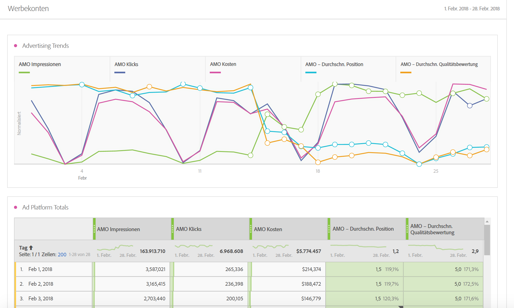
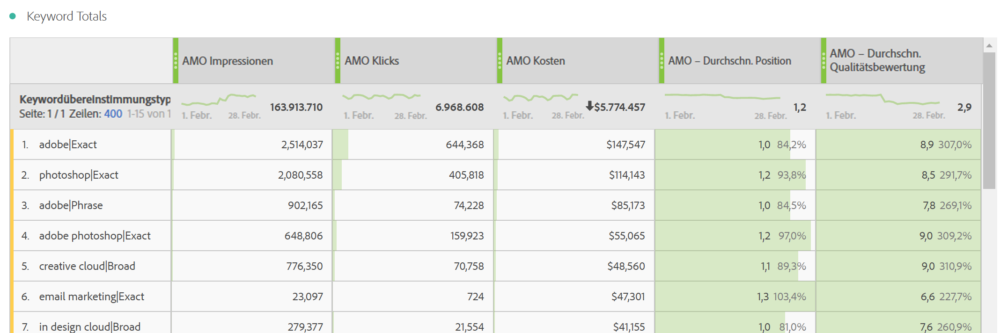
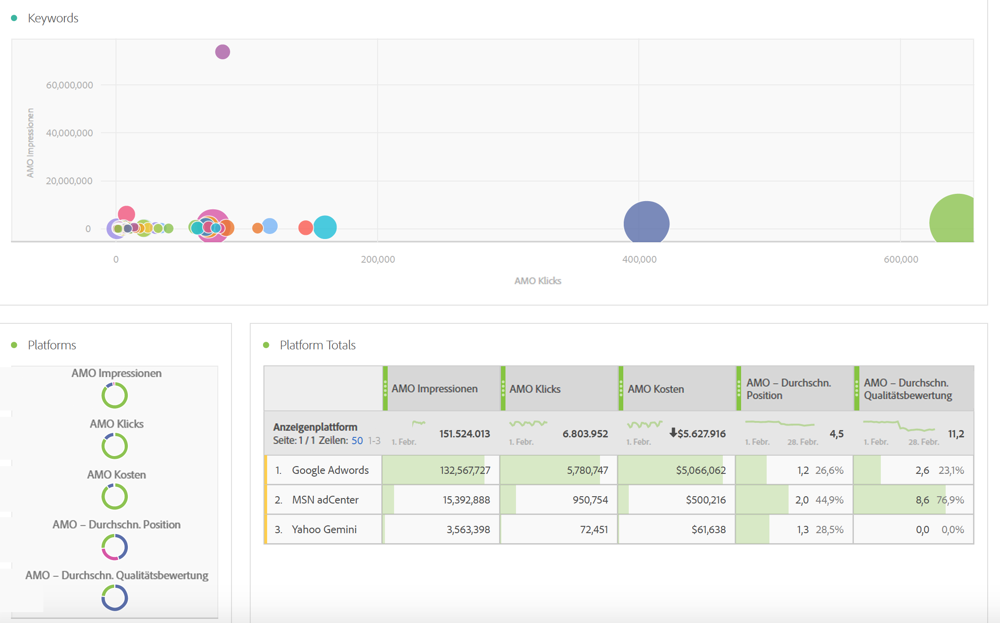
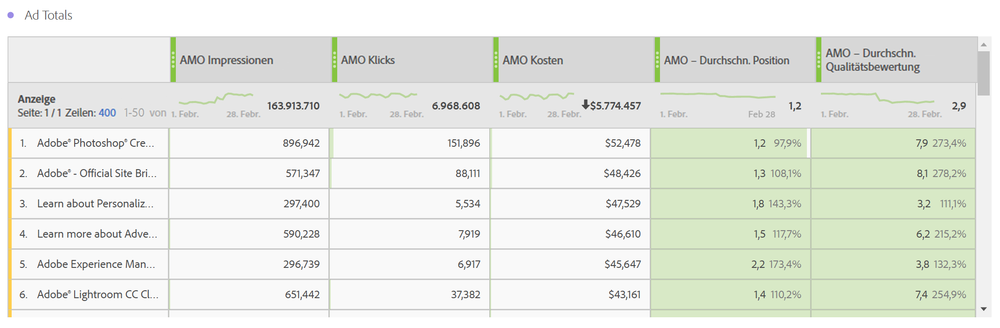
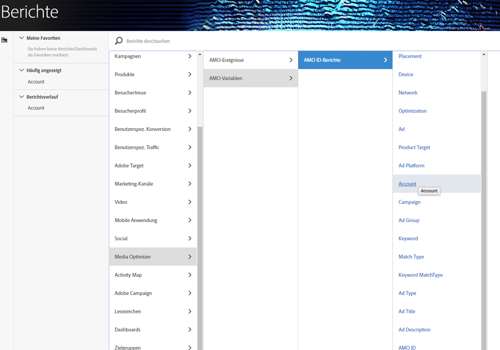

# Berichte zu Werbedaten in Adobe Analytics

Details zur Analysis Workspace-Vorlage sowie zum Reporting in Reports &amp; Analytics und Report Builder.

>[!NOTE]
>
>Es dauert in der Regel mindestens 24 Stunden, bis Suchmaschinendaten in Ihren Analytics-Berichten angezeigt werden. Beachten Sie, dass auch Analytics-Reporting keine Daten mit stündlicher Granularität zurückgibt, da AMO-Daten keine stündliche Granularität unterstützen.

## Analysis Workspace: Suchmaschinen {#section_8173F42B2C784F41B9FD82CBB66F9ADF}

Mit dieser Vorlage kann jeder, der die Suchmaschinen-Integration implementiert, in Analytics auf umfassende Suchmaschinendaten zugreifen. Der Zugriff erfolgt über **[!UICONTROL Workspace]** > **[!UICONTROL Vorlagen]** > **[!UICONTROL Advertising]** > **[!UICONTROL Suchmaschinen]**.

>[!NOTE]
>
>Die Kategorie „Advertising Template“ wird allen Kunden angezeigt, selbst wenn sie keine Werbekonten implementiert haben. Wenn Sie jedoch die Vorlage „ Suchmaschinen“ für ein Unternehmen öffnen, das nicht bereitgestellt wurde, werden Sie über eine Fehlermeldung darüber benachrichtigt, dass Sie noch keine Suchmaschinenkonten konfiguriert haben. Klicken Sie in diesem Fall auf **[!UICONTROL Jetzt konfigurieren]**. Hierdurch gelangen Sie zum Bildschirm zur [Einrichtung eines Werbekontos](/help/integrate/c-advertising-analytics/c-adanalytics-workflow/aa-create-ad-account.md).

       

| Tabelle/Visualisierung | Beschreibung |
|--- |--- |
| Werbetrends | Tägliche Übersicht mit Trenddaten für AMO-Impressionen, -Klicks und -Kosten |
| Anzeigenplattformen | Kreisdiagramm mit Kosten der führenden zwei Plattformen (Google, Bing) |
| Werbeplattform gesamt | Freiformtabelle der führenden Plattformen, aufgeschlüsselt nach AMO-Impressionen, -Klicks, -Kosten, durchschnittlicher AMO-Position und durchschnittlicher AMO- Qualitätsbewertung. |
| Konten | Zusammengefasster Kostenbereich |
| Konto gesamt | Freiformtabelle der führenden Konten, aufgeschlüsselt nach zugehörigen Metriken |
| Kampagnen | Balkendiagramm der Kampagnenkosten |
| Kampagnen gesamt | Freiformtabelle der führenden Kampagnen, aufgeschlüsselt nach zugehörigen Metriken |
| Gruppen | Baumstruktur der Kosten |
| Gruppe gesamt | Freiformtabelle der führenden Werbegruppen, aufgeschlüsselt nach zugehörigen Metriken |
| Werbeanzeigen | Horizontales Balkendiagramm der Impressionen, Klicks und Kosten |
| Werbeanzeige gesamt | Freiformtabelle der führenden Werbeanzeigen, aufgeschlüsselt nach zugehörigen Metriken |
| Keywords | Punktdiagramm der Impressionen, Klicks und Kosten für alle Kombinationen aus Keyword und Übereinstimmungstyp |
| Keyword gesamt | Freiformtabelle der führenden Kombinationen aus Keyword und Übereinstimmungstyp, aufgeschlüsselt nach zugehörigen Metriken |

## Reports &amp; Analytics {#section_BB2E75DF909C49EA8D4E92D14D6DFD85}

Sobald Sie ein Advertising Analytics-Konto eingerichtet haben, steht Ihnen der Advertising Analytics-Bericht zur Verfügung.

## Report Builder {#section_8E0371CF81144C33990D909685D1726E}

Sobald Sie ein Advertising Analytics-Konto eingerichtet haben, steht Ihnen der Advertising Analytics-Bericht zur Verfügung.
