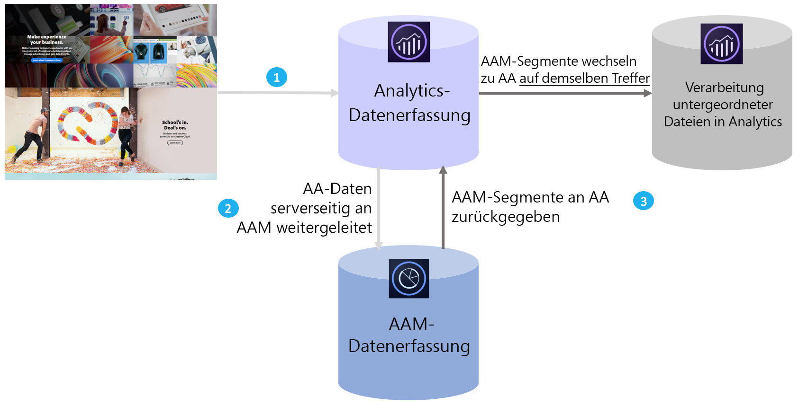

# Audience Analytics-Übersicht

Adobe Audience Manager (AAM) ist eine leistungsfähige Datenverwaltungsplattform, mit deren Hilfe Sie eindeutige Zielgruppenprofile durch Integration von Daten aus erster, zweiter (Partner) und dritter Hand aufbauen können. Advertiser können mithilfe dieser Zielgruppenprofile die wertvollsten Segmente für beliebige digitale Kanäle ermitteln.

Mit der Integration von Audience Analytics können Sie AAM-Zielgruppendaten wie demografische Informationen (z. B. Geschlecht oder Einkommensstufe), psychografische Informationen (z. B. Interessen und Hobbys), CRM-Daten und Daten zu Anzeigenimpressionen in einen beliebigen Analytics-Arbeitsablauf aufnehmen.

## Wesentliche Vorteile {#section_94816D17283349E0BA28521BE55BB868}

Die Audience Analytics-Integration umfasst die folgenden wesentlichen Vorteile:

* Es ist die erste zu einem eigenen Produkt gemachte Integration zwischen einer Daten-Management-Plattform (DMP) und einer Analyse-Engine auf dem Markt.
* Segmente werden in Echtzeit von AAM an Analytics freigegeben, um Informationen über erkannte Zielgruppen, Segmentierung und Optimierung zu liefern.
* Alle AAM-Segmente werden standardmäßig freigegeben und bereichern somit vollständig die Kundenprofile in Analytics.
* Administratoren der Lösung können die Integration über die Benutzeroberfläche aktivieren. Dabei ist nur eine minimale Anpassung des Codes erforderlich.
* Es werden nur Segmente freigegeben, die den Bestimmungen für das Exportieren von Audience Manager-Daten entsprechen.

## Funktionsweise {#section_CECDF5A0FEC64264B206EFEF54F19EF2}

1. Bei jedem Besuch eines Benutzers Ihrer digitalen Eigenschaften werden Treffer gesammelt und an Analytics weitergeleitet.
1. Mit [Serverseitige Weiterleitung](/help/admin/admin/c-server-side-forwarding/ssf.md) wird jeder Treffer, den Analytics erhält, automatisch in Echtzeit an AAM gesendet.
1. Durch die Audience Analytics-Integration wird in Echtzeit für jeden Treffer die Zugehörigkeit eines Besuchers in einer Zielgruppe in AAM überprüft und eine Liste von Segment-IDs an Analytics zur Verarbeitung zurückgegeben.

Da AAM-Segmente auf Grundlage übereinstimmender Treffer eingefügt werden, haben Sie die Gewissheit, dass die in AAM verfügbaren Daten zu einem Besucher für den jeweiligen Treffer vollständig und aktuell sind. Dies ist einem AppMeasurement-Plugin überlegen, da ein Plugin diese Segmente erst beim nächsten Treffer (und nicht schon beim aktuellen Treffer) verfügbar machen kann.

Darüber hinaus werden die AAM-Segment-IDs nach ihren Anzeigenamen klassifiziert, sodass Sie in Analytics-Berichten nicht nach alphanumerischen IDs suchen müssen.

## Voraussetzungen {#section_A345DC31F7D44EAE9DC1AB53E824C0CC}

Stellen Sie sicher, dass folgende Voraussetzungen erfüllt sind:

* Sie sind Kunde sowohl von Audience Manager als auch von Adobe Analytics.
* Sie sind ein Audience Manager-Administrator.
* Sie verwenden den Identitätsdienst v1.5 oder höher.
* AAM und Adobe Analytics werden [derselben Experience Cloud-Organisation zugeordnet](https://docs.adobe.com/content/help/de-DE/core-services/interface/about-core-services/report-suite-mapping.html).
* Sie nutzen [die serverseitige Weiterleitung](/help/admin/admin/c-server-side-forwarding/ssf.md) und haben das [Zielgruppen-Management-Modul](https://docs.adobe.com/content/help/de-DE/audience-manager/user-guide/implementation-integration-guides/integration-other-solutions/audience-management-module.html) AppMeasurement 1.5 oder höher (kein DIL-Code) implementiert.

Diese Voraussetzungen werden im [Audience Analytics-Workflow](/help/integrate/c-audience-analytics/c-workflow/audiences-workflow.md) beschrieben.
