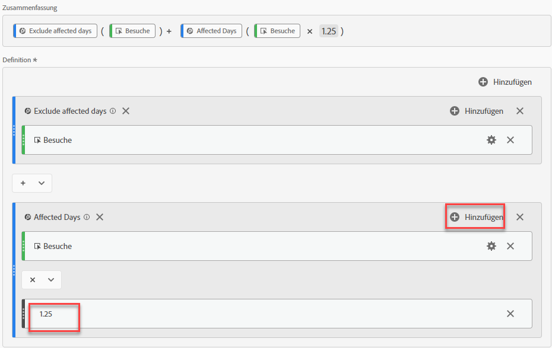
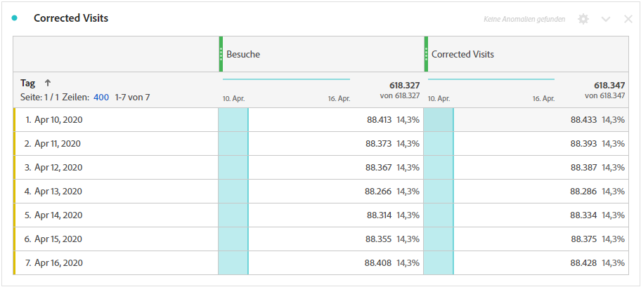

# Ableiten von Daten, die von Ereignissen betroffen sind

Wenn Sie Daten [auf ein Ereignis](overview.md) auswirken, können Sie berechnete Metriken verwenden, um geschätzte Werte für die Dauer des Ereignisses abzuleiten. Wenn Sie z. B. ein Ereignis hatten, das zu einem Datenverlust von 25 % führte, können Sie dies als Multiplikator in einer berechneten Metrik verwenden.

Diese Schritte funktionieren am besten, wenn Sie die Auswirkungen eines Ereignisses aus der Sicht der Segmentierung und des Datumsvergleichs verstehen. Vergewissern Sie sich, dass Sie die Datumsangaben, die von einem Ereignis beeinflusst wurden, mit den vorhergehenden Datumsbereichen](compare-dates.md) und [Ausschließen bestimmter Datumsangaben in Analyse](segments.md) befolgen, bevor Sie dieser Seite folgen.[

>[!NOTE]
>
>Bei diesem Ansatz handelt es sich um eine Schätzung, die auf einem bestimmten Satz von Eingaben und Datumsbereichen basiert. Es wird keine umfassende Lösung für alle Anwendungsfälle oder Datenscheiben sein. Darüber hinaus erfordert dieser Ansatz, dass der betroffene Datumsbereich mindestens einen Treffer aufweist, aus dem berechnet werden soll.

So erstellen Sie eine geschätzte berechnete Metrik für den betroffenen Zeitraum:

1. Erstellen Sie zwei Segmente für &quot;Betroffene Tage&quot;und &quot;Betroffene Tage ausschließen&quot;, wie unter [Bestimmte Daten in Analyse](segments.md) ausschließen beschrieben.
2. Navigieren Sie zu **[!UICONTROL Komponenten]** > **[!UICONTROL Berechnete Metriken]**.
3. Klicken Sie auf **[!UICONTROL Hinzufügen]**.
4. Ziehen Sie beide oben genannten Segmente in die Arbeitsfläche der Definition. Ändern Sie den Operator zwischen ihnen in `+`, um sie zusammenzufassen.
5. hinzufügen Sie die gewünschte Metrik in beiden Segmenten. Sie können beispielsweise die Metrik &quot;Besuche&quot;verwenden.

   

6. Klicken Sie oben rechts im Container &quot;Betroffene Tage&quot;auf **[!UICONTROL Hinzufügen]** und dann auf **[!UICONTROL Statische Zahl]**. Stellen Sie die statische Zahl auf den Prozentwert ein, mit dem Sie Ihre Daten verrechnen möchten, wie unter [Datum vergleichen, das von einem Ereignis beeinflusst wird, mit vorherigen Datumsbereichen](compare-dates.md) beschrieben. In diesem Beispiel beträgt der Offset 25 % oder 1,25.

   

7. Wenden Sie die &quot;korrigierte&quot;Metrik nebeneinander in einer Trendfreie Tabelle an. Alle Tage außerhalb des Ereignisses beziehen sich auf ihre normale Metrikanzahl, während alle betroffenen Tage den Multiplikator-Offset verwenden.

   

8. Ansicht der Daten in einer Linienvisualisierung, um die Auswirkungen Ihrer korrigierten Metrik zu sehen.

   
