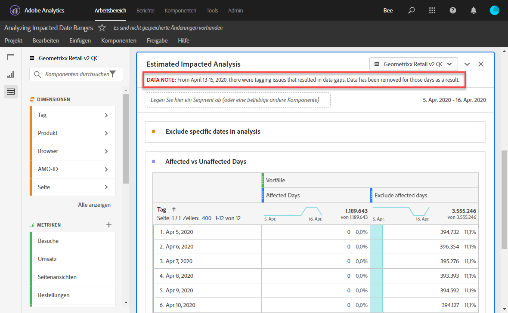
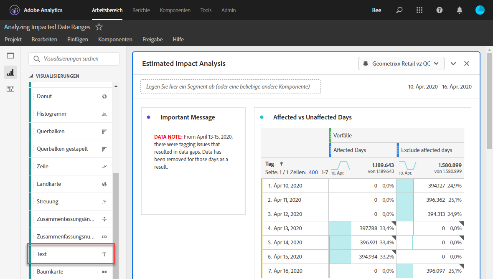
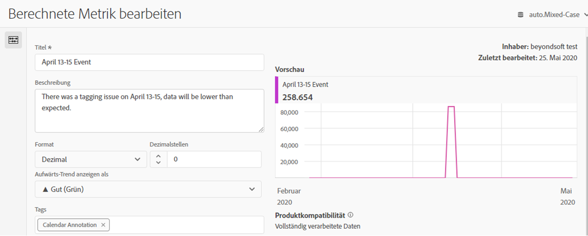
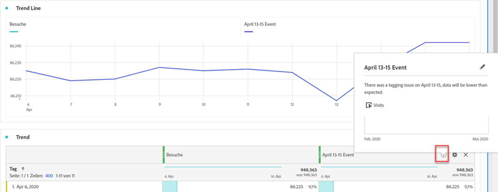

# Auswirkungen des Ereignisses auf Benutzer kommunizieren

Wenn Daten [von einem Ereignis](overview.md) betroffen sind, ist es wichtig, dieses Ereignis den Benutzern in Ihrem Unternehmen mitzuteilen.

* Entwickeln Sie einen allgemeinen Haftungsausschluss, den Sie zur Konsistenz in der Kommunikation verwenden können.
* Fortlaufende Kommunikation mit Analytics-Benutzern und wichtigen Interessenvertretern während und nach dem Ereignis
* Fügen Sie eine Kalendererinnerung für nachfolgende Meilensteine ein, z. B. für den folgenden Monat oder das folgende Jahr. Diese Mitteilung in der Zukunft soll Benutzer, die Berichte anzeigen, daran erinnern, wie sich die Berichte über Monate oder über Jahre auswirken.

In Adobe Analytics zeigen die folgenden Abschnitte verschiedene Möglichkeiten zur Kommunikation mit Benutzern in Ihrem Unternehmen. Sie können auch andere Methoden außerhalb von Adobe Analytics verwenden, z. B. E-Mail, um mit Benutzern zu kommunizieren.

## Kommunikation über Bedienfeld- oder Visualisierungsbeschreibungen

Wenn Sie ein Workspace-Projekt verwenden, das von Benutzern in Ihrem Unternehmen gemeinsam genutzt wird, können Sie die Auswirkungen eines Ereignisses über Bedienfeld- oder Visualisierungsbeschreibungen kommunizieren. Klicken Sie mit der rechten Maustaste auf ein Bedienfeld oder eine Visualisierungskopfzeile und wählen Sie **[!UICONTROL Beschreibung bearbeiten]**.

## Kommunikation über Textvisualisierungen

Sie können die Auswirkungen eines Ereignisses auch über spezielle Textvisualisierungen kommunizieren. Siehe [Textvisualisierungen](/help/analyze/analysis-workspace/visualizations/text.md) im Benutzerhandbuch Analysieren.

## hinzufügen benutzerdefinierter Kalender-Ereignis zu Trends in Workspace

Für jede Trendvisualisierung in Workspace können Sie eine Reihe hinzufügen, die Ihren betroffenen Datumsbereich darstellt.

1. Erstellen Sie eine berechnete Metrik mit dem Segment &quot;Betroffene Tage&quot;, indem Sie nach [Bestimmte Daten in Analyse](segments.md) ausschließen.
1. hinzufügen Sie die gewünschte Metrik in die Arbeitsfläche für berechnete Metriken.

   

1. hinzufügen einen Titel und eine Beschreibung, die die Benutzer über die Auswirkungen informieren. Sie können diese Metrik bei Bedarf auch als Kalenderanmerkung taggen.

   

1. Fügen Sie in einer Freiformtabelle die Dimension &quot;Tag&quot;hinzu. hinzufügen Sie &quot;Besuche&quot;und Ihre berechnete Metrik als Spalten nebeneinander an.

   

1. Klicken Sie auf das Zahnradsymbol für die Spalteneinstellungen für Ihre berechnete Metrik und aktivieren Sie **[!UICONTROL Null als keinen Wert]** interpretieren.

   

1. hinzufügen einer Linienvisualisierung. Betroffene Tage werden mit einer anderen Farbe dargestellt. Benutzer können auch auf das Symbol &quot;Info&quot;in der berechneten Metrik klicken, um weitere Informationen zu erhalten.

   

## Kalendereinstellungen in Reports &amp; Analysen verwenden

Wenn Sie Reports &amp; Analysen verwenden, können Sie mit einem [calendar-Ereignis](/help/components/t-calendar-event.md) die betroffenen Tage in einem beliebigen Trendbericht hervorheben. Diese Methode gilt nicht für Analysis Workspace.

1. Navigieren Sie zu **[!UICONTROL Komponenten]** > **[!UICONTROL Kalenderkomponenten]**.
2. Geben Sie den gewünschten Titel, den Datumsbereich und den Notiztext ein.
3. Klicken Sie auf **[!UICONTROL Speichern]**.

