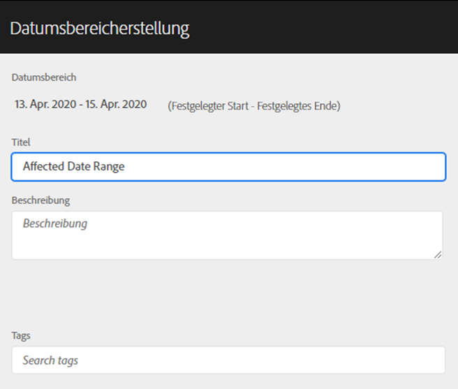
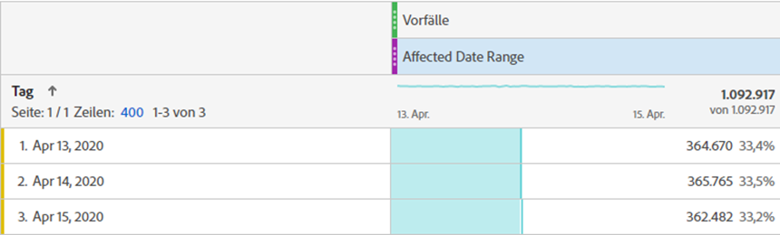
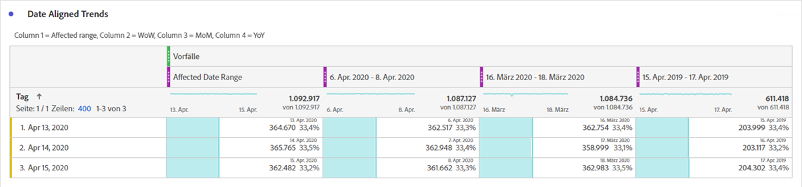
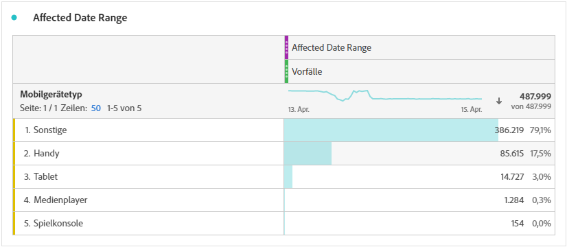
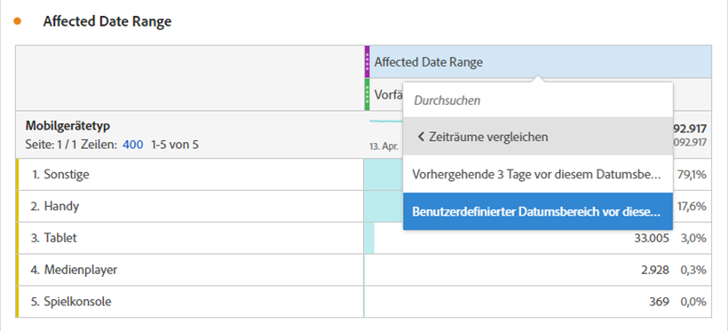
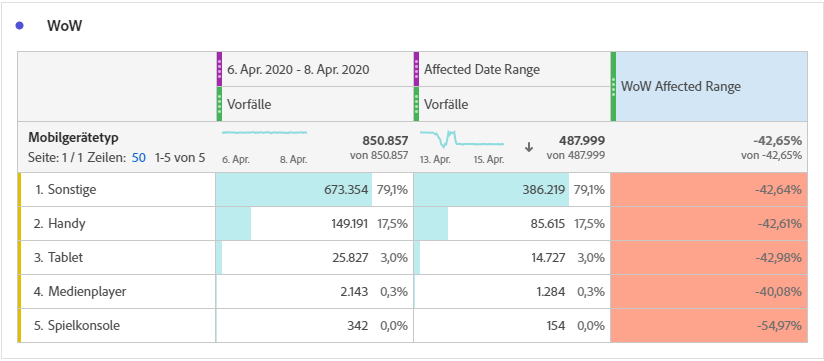
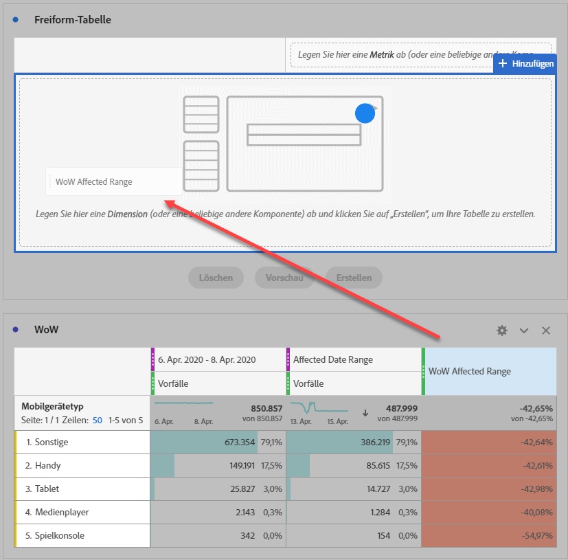
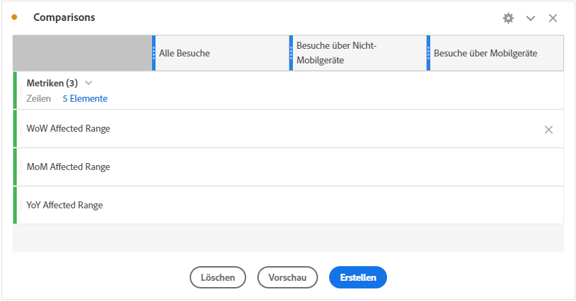
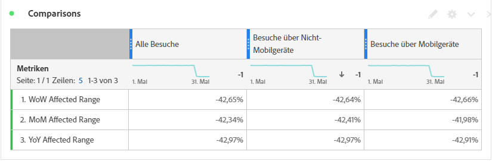

# Datumswerte, die von einem Ereignis beeinflusst wurden mit vorherigen Datumsbereichen vergleichen

Wenn Daten [von einem Ereignis](overview.md) betroffen sind, können Sie historische Trends betrachten, um deren Auswirkungen abzuschätzen. Dieser Vergleich ist hilfreich, um zu verstehen, wie stark sich ein Ereignis auf Ihre Daten auswirkt. Sie können also entscheiden, ob die Daten ausgeschlossen, Berichte mit Anmerkungen versehen oder ignoriert werden sollen.

## Erstellen Sie einen Datumsbereich, der das Ereignis enthält

Erstellen Sie einen Datumsbereich, der das Ereignis umfasst, um die Auswirkungen dieses Ereignisses zu untersuchen.

1. Navigieren Sie zu **[!UICONTROL Komponenten]** > **[!UICONTROL Datumsbereiche]**.
2. Klicken Sie auf **[!UICONTROL Hinzufügen]**.
3. Wählen Sie den Datumsbereich aus, in dem das Ereignis aufgetreten ist. Klicken Sie auf **[!UICONTROL Speichern]**.

   

## Daten zum Ereignis der Ansicht und ähnliche frühere Bereiche nebeneinander

Sie können eine beliebige Metrik zwischen dem Datumsbereich des Ereignisses mit ähnlichen vorherigen Datumsbereichen vergleichen, indem Sie eine Freiformtabellenvisualisierung verwenden.

1. Öffnen Sie ein Workspace-Projekt und fügen Sie der Freiform-Tabelle die Dimension &quot;Tag&quot;hinzu. Wenden Sie den kürzlich erstellten Datumsbereich auf eine Metrik wie &quot;Vorfälle&quot;an.

   

2. Klicken Sie mit der rechten Maustaste auf den Datumsbereich und klicken Sie dann auf **[!UICONTROL Hinzufügen Spalte Zeitraum]** > **[!UICONTROL Benutzerspezifischer Datumsbereich bis zu diesem Datumsbereich]**.
   * Wählen Sie für einen wöchentlichen Vergleich den Bereich des Ereignisses minus 7 Tage aus. Stellen Sie sicher, dass die Wochentage zwischen dem Ereignis und diesem Datumsbereich ausgerichtet sind.
   * Wählen Sie für einen Monatsvergleich den Bereich des Ereignisses im letzten Monat aus. Sie können auch den Bereich des Ereignisses minus 28 Tage auswählen, wenn Sie die Wochentage ausrichten möchten.
   * Wählen Sie für einen Jahresvergleich den Bereich des Ereignisses im letzten Jahr aus.
3. Wenn Sie den gewünschten Datumsbereich auswählen, werden diese der Freiformtabelle hinzugefügt. Sie können mit der rechten Maustaste klicken und so viele Datumsbereiche hinzufügen, wie Sie vergleichen möchten.

   

## Prozentsatzdifferenzen zwischen dem Ereignis und ähnlichen vorherigen Bereichen berechnen

Vergleichen Sie Dimensionselemente zwischen dem Datumsbereich eines Ereignisses und ähnlichen vorherigen Datumsbereichen mithilfe einer Freiform-Tabellenvisualisierung. Diese Schritte illustrieren ein wöchentliches Beispiel, dem Sie folgen können.

1. Öffnen Sie ein Workspace-Projekt und fügen Sie der Freiform-Tabelle eine **Nicht-Zeitdimension** hinzu. Sie können beispielsweise die Dimension &quot;Mobilgerätetyp&quot;verwenden. Wenden Sie den kürzlich erstellten Datumsbereich auf eine Metrik wie &quot;Vorfälle&quot;an:

   

2. Klicken Sie mit der rechten Maustaste auf den Datumsbereich und klicken Sie dann auf **[!UICONTROL Zeiträume vergleichen]** > **[!UICONTROL Benutzerspezifischer Datumsbereich bis zu diesem Datumsbereich]**. Wählen Sie den Bereich des Ereignisses minus 7 Tage aus. Stellen Sie sicher, dass die Wochentage zwischen dem Ereignis und diesem Datumsbereich ausgerichtet sind.

   

3. Benennen Sie die resultierende Metrik &quot;Prozentuale Änderung&quot;in einen spezifischeren Bereich um, z. B. &quot;Wow-betroffener Bereich&quot;. Klicken Sie auf das Infosymbol und dann auf den Stift bearbeiten, um den Metriknamen zu bearbeiten.

   

4. Wiederholen Sie die Schritte 3 und 4 für den Vergleich von Monaten und Jahren. Sie können diese Aktion in derselben Tabelle oder in separaten Tabellen ausführen.

## Vergleichsdatumsbereiche nebeneinander als Zeilen analysieren

Wenn Sie die oben genannten prozentualen Änderungen weiter analysieren möchten, können Sie sie in Zeilen konvertieren.

1. hinzufügen Sie eine Freiform-Tabellenvisualisierung und aktivieren Sie den Tabellenaufbau. Mit dieser Aktion können Sie die Metriken zur prozentualen Änderung in der gewünschten Reihenfolge platzieren.
2. Halten Sie die Taste `Ctrl` (Windows) bzw. `Cmd` (Mac) gedrückt und ziehen Sie die Metriken für die Veränderung von 3 Prozent nacheinander in die Tabellenzeilen.

   

3. hinzufügen Sie das Segment &quot;Alle Besuche&quot;in die Spalte der Tabelle und alle anderen gewünschten Segmente.

   

4. Klicken Sie auf **[!UICONTROL Erstellen]**. Aus der Tabelle können Sie die betroffenen Bereiche im Vergleich zur Vorwoche, zum Vormonat und zum Vorjahr für alle gewünschten Segmente Ansicht werden.

   
