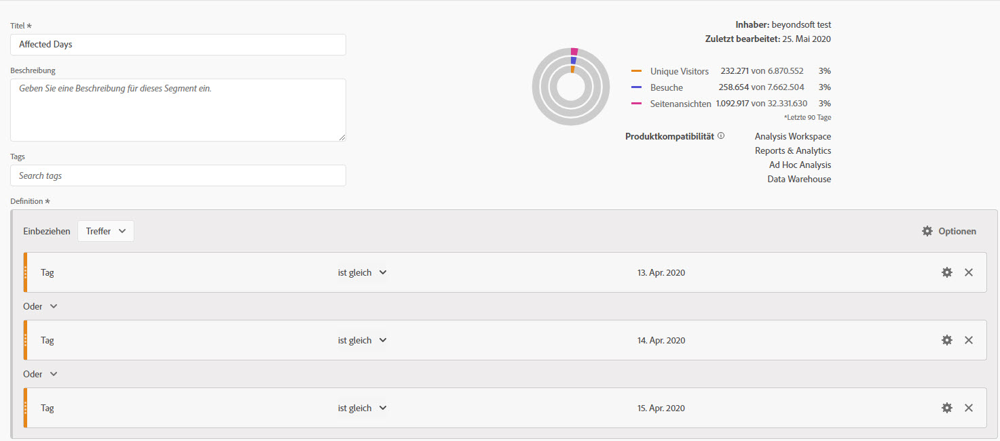
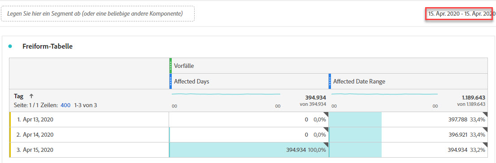
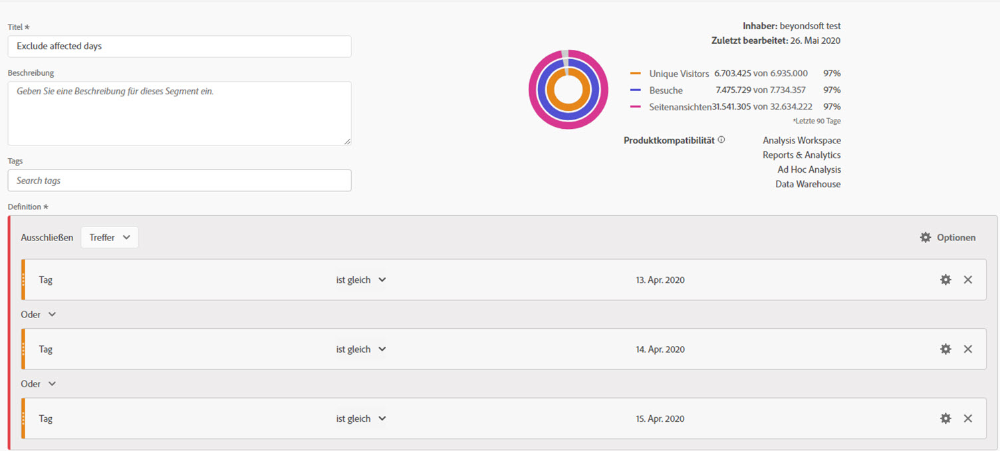
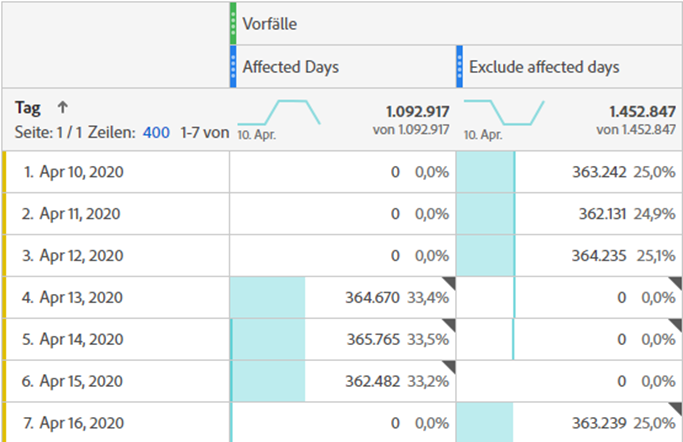
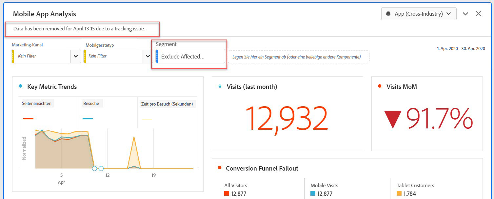
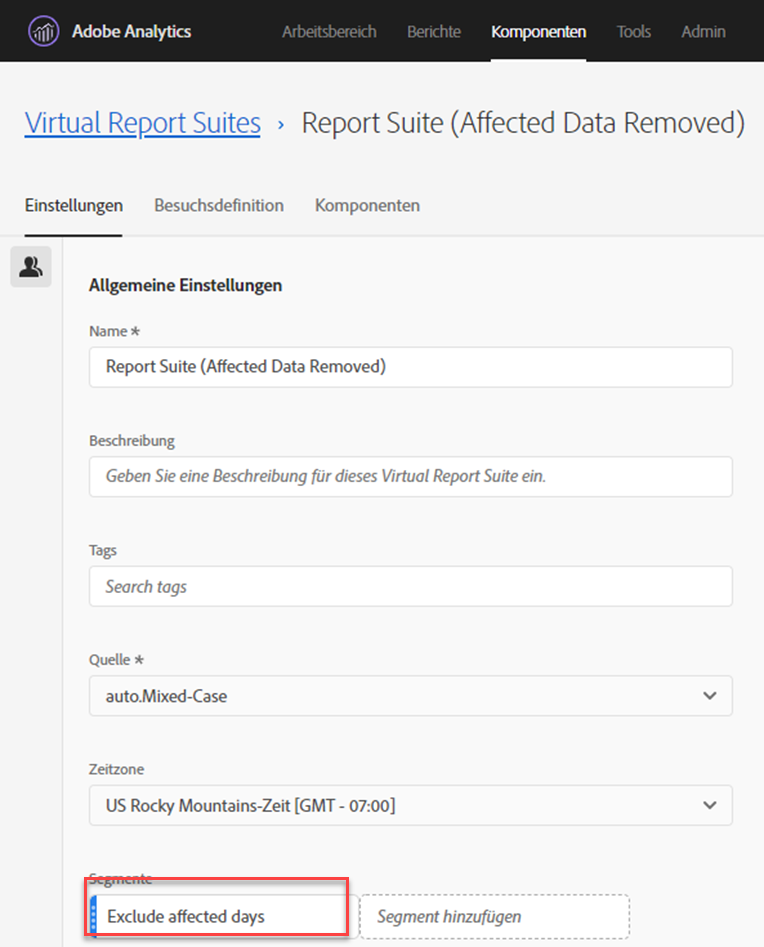

# Ausschließen spezifischer Daten in der Analyse

Wenn Sie Daten [von einem Ereignis](overview.md) beeinflusst haben, können Sie ein Segment verwenden, um alle Datumsbereiche auszuschließen, die Sie nicht in Ihre Berichte aufnehmen möchten. Die Segmentierung von Datumsangaben, die vom Ereignis betroffen sind, kann dazu beitragen, dass Ihr Unternehmen keine Entscheidungen zu partiellen Daten trifft.

## Betroffene Tage isolieren

Erstellen Sie ein Segment, das den betroffenen Tag oder Datumsbereich isoliert. Dieses Segment ist nützlich, wenn Sie sich nur auf die Problemtage konzentrieren möchten, um weitere Informationen über die Auswirkungen zu erhalten.

1. Öffnen Sie den Segmentaufbau, indem Sie **[!UICONTROL Komponenten]** > **[!UICONTROL Segmente]** aufrufen und dann auf **[!UICONTROL Hinzufügen]** klicken.
2. Ziehen Sie die Dimension &quot;Tag&quot;auf die Arbeitsfläche der Definition und legen Sie sie auf den Tag fest, den Sie isolieren möchten.
3. Wiederholen Sie den obigen Schritt für jeden Tag, den Sie in Ihrem Bericht isolieren möchten.

Adobe empfiehlt die Verwendung der orangefarbenen Dimensionskomponenten und nicht der lila Datumsbereichskomponenten. Wenn Sie violette Datumsbereichskomponenten verwenden, setzen diese den Kalenderbereich des Projekts außer Kraft:

## Betroffene Tage ausschließen

Erstellen Sie ein Segment, das den betroffenen Tag oder Datumsbereich ausschließt. Dieses Segment ist nützlich, wenn Sie die aufgetretenen Berichte ausschließen möchten, um die Auswirkungen auf den Gesamtwert zu minimieren.

1. Öffnen Sie den Segmentaufbau, indem Sie **[!UICONTROL Komponenten]** > **[!UICONTROL Segmente]** aufrufen und dann auf **[!UICONTROL Hinzufügen]** klicken.
2. Klicken Sie oben rechts auf der Arbeitsfläche für die Segmentdefinition auf **[!UICONTROL Optionen]** > **[!UICONTROL Ausschließen]**.
3. Ziehen Sie die Dimension &quot;Tag&quot;auf die Arbeitsfläche der Definition und legen Sie sie auf den Tag fest, den Sie entfernen möchten.
4. Wiederholen Sie den obigen Schritt für jeden Tag, den Sie in Ihrem Bericht entfernen möchten.

## Verwenden Sie diese Segmente in Berichten

Nachdem Sie das Segment zum Ausschließen erstellt haben, können Sie es genauso verwenden wie andere Segmente.

### Vergleichen von Segmenten in einem Trendbericht

Sie können sowohl das Segment &quot;Betroffene Tage&quot;als auch das Segment &quot;Betroffene Tage ausschließen&quot;in einem Bericht anwenden, um sie nebeneinander zu vergleichen. Ziehen Sie beide Segmente über oder unter eine Metrik, um sie zu vergleichen:

Wenn Sie keine Nullen in der Tabelle oder in Visualisierungen anzeigen möchten (wodurch Dips entstehen), aktivieren Sie unter Spalteneinstellungen die Option **[!UICONTROL Null als kein Wert]** interpretieren.

Wenn Sie keine Nullen in der Tabelle oder in Visualisierungen anzeigen möchten (wodurch Dips entstehen), aktivieren Sie unter Spalteneinstellungen die Option **[!UICONTROL Null als kein Wert]** interpretieren.

### Anwenden des Ausschlusssegments auf ein Projekt

Sie können das Segment &quot;Betroffene Tage ausschließen&quot;auf ein Workspace-Projekt anwenden. Ziehen Sie das Ausschlusssegment in den Arbeitsbereich-Arbeitsbereich mit der Bezeichnung *Segment hier ablegen*.

>[!TIP]
>
>Fügen Sie eine Notiz zu den ausgeschlossenen Daten in die Beschreibung des Bedienfelds ein, damit die Benutzer den Bericht anzeigen können. Klicken Sie mit der rechten Maustaste auf den Titel eines Bedienfelds und klicken Sie dann auf **[!UICONTROL Beschreibung bearbeiten]**.

### Verwenden Sie das Ausschlusssegment in einer Virtual Report Suite

Sie können das Segment in einer [Virtual Report Suite](/help/components/vrs/vrs-about.md) verwenden, um die Daten bequemer auszuschließen. Diese Option ist ideal, da Sie nicht vergessen müssen, das Segment für jeden Bericht anzuwenden, der den betroffenen Datumsbereich enthält. Wenn Sie Virtual Report Suites bereits als primäre Datenquelle verwenden, können Sie das Segment zu einer vorhandenen VRS hinzufügen.

1. Navigieren Sie zu **[!UICONTROL Komponenten]** > **[!UICONTROL Virtual Report Suites]**.
2. Klicken Sie auf **[!UICONTROL Hinzufügen]**.
3. Geben Sie den gewünschten Namen und die Beschreibung für die Virtual Report Suite ein.
4. Ziehen Sie das Ausschlusssegment in den Bereich **[!UICONTROL Hinzufügen Segment]**.
5. Klicken Sie oben rechts auf **[!UICONTROL Weiter]** und dann auf **[!UICONTROL Speichern]**.

