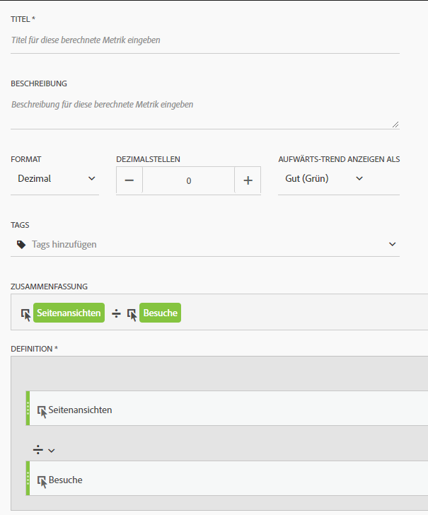
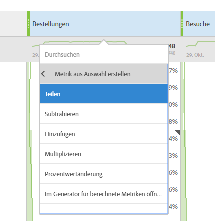

# Häufig verwendete Metriken in anderen Plattformen für die Übersetzung von Plattformen

Auf anderen Plattformen wie Google Analytics geben viele Berichte eine allgemeine Anzahl von Metriken frei. Auf dieser Seite erfahren Sie, wie Sie die in vielen Berichten verwendeten Metriken neu erstellen.

Um einer Freiform-Tabelle des Arbeitsbereichs mehrere Metriken hinzuzufügen, ziehen Sie die Metrik aus dem Komponentenbereich neben der Metriküberschrift in der Arbeitsfläche:

## Akquise-Metriken

**Benutzer** sind in Workspace ungefähr gleich **individueller Besucher** . See the [Unique Visitors](../../../components/c-variables/c-metrics/metrics-unique-visitors.md) metric in the Components user guide for additional details.

**Neue Benutzer** erhalten Folgendes:

1. Drag the **Unique Visitors** metric onto the workspace.
2. Drag the **First Time Visits** segment above the Unique Visitors metric headers:

   

**Die Sitzungen** entsprechen ungefähr **den Besuchen** im Analysis Workspace. See the [Visits](../../../components/c-variables/c-metrics/metrics-visit.md) metric in the Components user guide for additional details.

## Verhaltensmetriken

**Die Absprungrate** ist im Analysis Workspace als Metrik problemlos verfügbar. See the [Bounce Rate](../../../components/c-variables/c-metrics/metrics-bounce-rate.md) metric in the Components user guide for additional information.

**Seiten/Sitzung** ist eine berechnete Metrik. Sie erhalten Folgendes:

1. Wenn Sie diese berechnete Metrik bereits erstellt haben, suchen Sie sie unter Metriken und ziehen Sie sie auf den Arbeitsbereich.
2. If you have not yet created this calculated metric, click the **+** icon near the metric list to open the Calculated Metric Builder.
3. Geben Sie den Titel "Seitenansichten pro Besuch" und eine Beschreibung ein, falls gewünscht.
4. Legen Sie das Format auf "Dezimal" fest und legen Sie die Anzahl der Dezimalstellen auf 2 fest.
5. Drag the **Page views** metric and **Visits** metric into the definition area.
6. Arrange the definition so the formula is **Page Views divided by Visits**.

   

7. Klicken Sie auf Speichern, um zu Ihrer Arbeitsfläche zurückzukehren.
8. Ziehen Sie die neu definierte berechnete Metrik auf die Arbeitsfläche.

   Learn more about [Calculated Metrics](../../../components/c-variables/c-metrics/calculated-metric.md) in the Components user guide.

**Durchschnittl. Session Duration** is approximately equal to **Time Spent per Visit (seconds)**. Learn more about [Time Spent](../../../components/c-variables/c-metrics/metrics-time-spent.md) metrics in the Components user guide.

## Konversionsmetriken

**Die Zielkonversionsrate**, **die Zielbeendigungen** und der **Zielwert** erfordern zusätzliche Implementierungen auf beiden Plattformen. Wenn Ihre Implementierung bereits die Produktdimension und das Kaufereignis anzeigt, gehen Sie wie folgt vor:

1. Drag the **Orders** metric, **Revenue** metric, and **Visits** metric onto the workspace.
1. Create a calculated metric of **Orders per Visit**. Halten Sie beim Klicken die Strg-Taste (Windows) bzw. Cmd + Cmd (Mac) gedrückt, um sie zu markieren. Right-click one of the headers, select **Create Metric From Selection**, then click **Divide**. Diese neue Metrik ähnelt einer Zielkonversionsrate.
1. Wenn Dezimalstellen erforderlich sind, bearbeiten Sie die berechnete Metrik. Klicken Sie in der Metrikkopfzeile auf die Info-Schaltfläche und dann auf das Stiftsymbol. Fügen Sie im Fenster Aufbau berechneter Metriken 1 oder 2 Dezimalstellen hinzu und klicken Sie dann auf Speichern.

   

Wenn Ihre Implementierung noch keine Produkt- oder Konversionsdaten umfasst, empfiehlt Adobe die Zusammenarbeit mit einem Implementierungsberater, um die Datenqualität und -integrität sicherzustellen.
