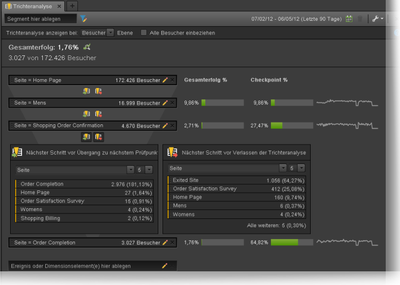

# Konversionsberichte

Eine'Umrechnung'ist eine Aktion, die ein Besucher auf Ihrer Site durchführt, die direkt in die Schlüsselindikatoren Ihrer Organisation übersetzt wird. Konversionsberichte zeigen Details zur Konvertierung von Besuchern an.

Diese Seite geht davon aus, dass der Benutzer über grundlegende Kenntnisse zur Verwendung des Analysis Workspace verfügt. See [Create a basic report in Analysis Workspace for Google Analytics users](create-report.md) if you are not yet familiar with the tool in Adobe Analytics.

## Berichte zu Zielen

Ziele bieten Google Analytics-Benutzern eine Möglichkeit, die Konversion einer Website zu definieren. Sie sind die Standardmethode zum Erstellen von Trichtern, Umkehrungsfluss, Mehrkanaltrichter und Zuordnung. Ziele in Google Analytics sind nicht rückwirkend und können nur auf der Admin-Seite eingerichtet werden. Darüber hinaus basieren sie nur auf einer Seite, einem Ereignis, einer Besuchszeit oder einer durchschnittlichen Anzahl vonseiten.

In Adobe Analytics ist das Konzept eines Ziels nicht erforderlich, da Metriken in jedem beliebigen Kontext angewendet werden können. Solange Ihre Implementierung die zu verfolgenden Ereignisse anzeigt, können Sie einen beliebigen Konversionsbericht ausführen und sofort Ergebnisse für historische Daten abrufen.

### Trichter Visualisierung

Der Trichtervisualisierungsbericht hilft Analysten, sich auf eine bestimmte Reihe von Schritten zu konzentrieren, die zur Umrechnung erforderlich sind. Vor einem Kauf müssten Besucher auf einer E-Commerce-Site beispielsweise auf den Einkaufswagen, auf Rechnungsstellung und auf Versandseite, auf Zahlungsseite und auf die Bestellseite zugreifen.

In Analysis Workspace können diese Daten mithilfe der Fallout-Visualisierung angezeigt werden.

1. Klicken Sie links auf das Visualisierungssymbol und ziehen Sie eine Fallout-Visualisierung auf den Arbeitsbereich oberhalb der Freiformtabelle.
2. Click the components icon on the left, then locate the **Pages** dimension.
3. Klicken Sie auf das Pfeilsymbol neben der Dimension "Seiten" , um die Seitenwerte anzuzeigen. Dimensionswerte sind gelb farbig.
4. Suchen Sie die gewünschte Seite als ersten Touchpoint und ziehen Sie sie in den Bereich mit der Bezeichnung "Touchpoint hinzufügen" in der Visualisierung.
5. Fügen Sie weitere Touchpoints hinzu, indem Sie die Seitenwerte auf die Visualisierung ziehen.

Die Fallout-Visualisierung ist nicht nur auf die Dimension "Seiten" beschränkt. Alle Dimensionen, Metriken oder Segmente können verwendet werden, um Ihren Trichteranalysebericht so anzupassen, dass er den Anforderungen Ihres Unternehmens entspricht.

## Ecommerce-Berichte

Ecommerce-Berichte werden gewöhnlich von Sites verwendet, die Produkte oder Dienste verkaufen, um Bestellungen und Umsätze bei gekauften Elementen zu messen. Diese Funktion ist in Adobe Analytics verfügbar und wird als Produktberichte bezeichnet.

Beide ecommerce-Berichte in Google Analytics und Produktberichte in Adobe Analytics erfordern benutzerdefinierte Implementierungsänderungen. See the [Products](../../../components/c-variables/dimensionslist/reports-products.md) dimension in the Components user guide for more information.

## Berichte über Mehrkanaltrichter

Mehrkanaltrichterberichte bieten zusätzliche Marketingkanaldaten, die über die bereitgestellten Akquiseberichte hinausgehen. Diese Berichte konzentrieren sich darauf, wie Besucher umgerechnet werden, anstatt wie Besucher zu Ihrer Site gelangen.

> [!NOTE]
>
> Die Verwendung von Mehrkanalberichten in Adobe Analytics erfordert sowohl das Setup von Marketingkanälen als auch eine benutzerdefinierte Implementierung, um die Produktvariable und das Kaufereignis aufzunehmen. Adobe empfiehlt, mit einem Implementierungsberater zusammenzuarbeiten, wenn diese Funktionen noch nicht für Ihre Report Suite konfiguriert sind.

### Mehrkanal - Unterstützte Konversionen

Die unterstützten Konversionen zeigen, wie oft jeder Kanal mit einer Konversion unterstützt wird. In Analysis Workspace, the **Order Assists** metric can be used.

1. In the Components menu, locate the **Marketing Channel** dimension and drag it onto the large freeform table area labeled 'Drop a Dimension here'.
2. Drag the **Order Assists** metric on top of the automatically created **Occurrences** metric header to replace it. Zusätzliche Metriken können auf den Arbeitsbereich gezogen werden, falls gewünscht.

### Mehrkanal - Top-Konversionspfade

Der Bericht zu Top-Konversionspfaden zeigt die Top-Kanalpfade an, die ein Benutzer vor der Konvertierung ausführt. Analysis Workspace nutzt einen Flussbericht, um Top-Konversionspfade visualisieren zu können.

1. Klicken Sie auf der linken Seite auf das Symbol "Bedienfelder" und ziehen Sie ein Zuordnungsbedienfeld über die Freiformtabelle.
2. Click the Components icon on the left, locate the **Marketing Channel** dimension, and drag it to the box labeled 'Add Dimension'.
3. Suchen Sie das gewünschte Konversionsereignis unter Metriken (z. B. Bestellungen) und ziehen Sie es in das Feld mit der Bezeichnung "Metrik hinzufügen" . Beachten Sie, dass berechnete Metriken für das Zuordnungsbedienfeld nicht unterstützt werden.
4. Klicken Sie auf Erstellen.
5. Suchen Sie im resultierenden Bericht die Visualisierung des Kanalflusses. Dieser Fluss zeigt die Top-Pfade an, die ein Besucher vor einem Kauf aufgerufen hat.

Diese Flussvisualisierung ist interaktiv. Klicken Sie auf jeden Kanal, um den Fluss in beiden Richtungen zu erweitern.

### Mehrkanal - Zeitverzögerung

Der Zeitverlaufsbericht zeigt den Zeitraum an, in dem ein Besucher die Konvertierung auf Ihrer Site auftrat. In Analysis Workspace, this data is available using the **Days Before First Purchase** dimension. Sie ist nur im Kontext eines korrekt implementierten Kaufereignisses verfügbar.

1. In the Components menu, locate the **Days Before First Purchase** dimension and drag it onto the large freeform table area labeled 'Drop a Dimension here'.
2. Drag the desired metrics onto the workspace alongside the automatically created **Occurrences** metric. See the [Metric translation guide](common-metrics.md) for details on how to obtain each respective metric.

Adobe recommends using the **Orders**, **Units**, or **Revenue** metrics with this dimension.

For other types of conversions, including custom events, the **Time Prior to Event** dimension is available. Es zeigt die Zeit in Minuten an, in der ein Besucher das Ereignis innerhalb des Besuchs auslöst.

1. In the Components menu, locate the **Time Prior to Event** dimension and drag it onto the large freeform table area labeled 'Drop a Dimension here'.
2. Drag the desired metrics onto the workspace alongside the automatically created **Occurrences** metric. See the [Metric translation guide](common-metrics.md) for details on how to obtain each respective metric.

Adobe empfiehlt, diese Dimension neben benutzerspezifischen Ereignissen oder Kaufereignissen zu verwenden.

### Mehrkanal - Pfadlänge

Der Pfadlängenbericht zeigt die Anzahl der Kanäle an, die vor einem Konversionsereignis aufgerufen wurden. Im Analysis Workspace enthält das Zuordnungsbedienfeld diese Daten in einer seiner Visualisierungen.

1. Klicken Sie auf das Symbol "Bedienfelder" links und ziehen Sie ein Zuordnungsbedienfeld über die Freiformtabelle.
2. Click the Components icon on the left, locate the **Marketing Channel** dimension, and drag it to the box labeled 'Add Dimension'.
3. Suchen Sie das gewünschte Konversionsereignis unter Metriken (z. B. Bestellungen) und ziehen Sie es in das Feld mit der Bezeichnung "Metrik hinzufügen" . Beachten Sie, dass berechnete Metriken für das Zuordnungsbedienfeld nicht unterstützt werden.
4. Klicken Sie auf Erstellen.
5. Suchen Sie im resultierenden Bericht die Visualisierung "Touchpoints pro Reise" . Dieses Histogramm zeigt die Anzahl der Kanäle an, die ein Besucher vor einem Kauf aufgerufen hat.
