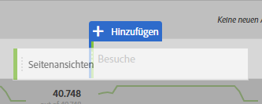
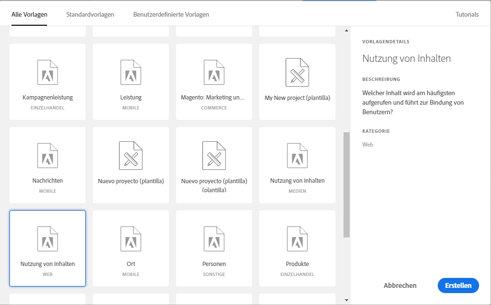

# Erstellen Sie einen grundlegenden Bericht im Analysis Workspace für Benutzer von Google Analytics.

Der Analysis Workspace (einer der Hauptfunktionen in Adobe Analytics) bietet einen robusten Bereich für einen Benutzer, um Einblicke in erfasste Daten zu erhalten. Die Berichterstellung unterscheidet sich von Google Analytics und Adobe Analytics:

* Mit der Berichterstellungsstruktur in Google Analytics können Sie einen bestimmten Datentyp auswählen, z. B. den geografischen Standort oder den Referrer-Traffic. Die Plattform verwendet eine vorab entwickelte Berichtsansicht, basierend auf der voraussichtlichen Möglichkeit zur Anzeige dieser Daten.
* Die Berichterstellungsstruktur im Analysis Workspace bietet eine leere Arbeitsfläche, die mehr Flexibilität bei der Erfüllung exakter Berichterstellungsanforderungen bietet.

Da Analysis Workspace mehr wie eine Arbeitsfläche funktioniert als vordefinierte Berichte, ist es einfach, Berichte aus Google Analytics zu erstellen und die richtigen Visualisierungen und Komponenten zu verwenden.

## In Workspace verwendete Schlüsselbegriffe

* **Bedienfelder** sind die übergeordneten Bausteine von Arbeitsbereichen. In fast allen Szenarien wird ein Freiform-Bedienfeld verwendet.
* **Visualisierungen** bilden alle Freiform-Bedienfelder. Ihr Zweck besteht darin, Daten in verschiedenen Formaten darzustellen. Die meisten Formate sind eine Tabelle, aber andere Zeiten wie ein Ringdiagramm oder ein Liniendiagramm. Viele Berichte in Google Analytics stammen aus zwei Visualisierungen: ein Liniendiagramm und eine Freiform-Tabelle.
* **Komponenten** werden in einer Visualisierung platziert, um Daten zurückzugeben. Komponenten können auf viele verschiedene Arten gemischt werden, um die Berichterstellungsanforderungen zu erfüllen.
   * **Dimensionen** sind Variablenwerte und enthalten normalerweise Text. Beispiele sind Seitenname, verweisende Stelle oder Geo-Land. Sie werden meist als Zeilen in einer Tabelle aufgeführt.
   * **Metriken** zeigen in der Regel ein Ereignis oder eine Konversion einiger Sortierungen an. Beispiele sind gängige Ereignisse wie eine Seitenansicht oder etwas wichtiger, wie ein Kauf oder eine Registrierung. Sie werden meist als Spalten in Tabellen angesehen, um anzuzeigen, wie oft das Ereignis pro Dimension aufgetreten ist.
   * **Segmente** sind eine Untergruppe Ihrer Daten und verhalten sich ähnlich wie Segmente in Google Analytics. Sie ermöglichen es Ihnen, benutzerdefinierte Filter zu erstellen, sodass Sie sich auf einen bestimmten Teil Ihrer Daten konzentrieren können.
   * **Mit Datumsbereichen** können Sie Daten nach einem Ereignis organisieren. Sie sind der Backbone der Anzeige von Trends im Zeitverlauf und werden normalerweise mit einer Metrik gepaart.

## Einen einfachen Bericht in Workspace erstellen

Erstellen Sie einen Bericht Alle Seiten (ähnlich wie in Google Analytics), indem Sie die richtigen Komponenten auf eine Arbeitsfläche ziehen.

1. Log in to [experiencecloud.adobe.com](https://experiencecloud.adobe.com) using your Adobe ID credentials.
2. Klicken Sie oben rechts auf das 9-quadratische Symbol und dann auf das farbige Analytics-Logo.
3. Klicken Sie in der oberen Navigationsleiste auf Arbeitsbereich.
4. Klicken Sie auf die Schaltfläche &quot;Neues Projekt erstellen&quot; .
5. Stellen Sie im modalen Popup sicher, dass &quot;Leeres Projekt&quot; ausgewählt ist, und klicken Sie dann auf Erstellen.
6. Auf der linken Seite wird eine Liste von Dimensionen, Metriken, Segmenten und Datumsbereichen angezeigt. Suchen Sie die Dimension &quot;Seiten&quot; (orange) und ziehen Sie sie auf die Arbeitsfläche mit der Bezeichnung&quot; Dimension hier ablegen&quot; .
7. Ein Bericht, der die Top-Seiten für diesen Monat anzeigt, kann angezeigt werden. Analysis Workspace automatically populates the report with the [Occurrences](../../../components/c-variables/c-metrics/metrics-occurrences.md) metric.
8. Eine Tabelle in Google Analytics enthält normalerweise 7-8 Metriken. Suchen Sie die Metrik &quot;Absprungrate&quot; (farbig grün) und ziehen Sie sie neben der Kopfzeile&quot; Vorfälle&quot; . Wenn Sie die Metrik &quot;Absprungrate&quot; neben&quot; Vorfälle&quot; ziehen, werden beide Metriken nebeneinander angezeigt.
9. Viele Metriken können nebeneinander platziert werden, indem Metriken neben vorhandenen Metriküberschriften gezogen werden. See [commonly used metrics](common-metrics.md) for information on how to obtain metrics typically used in Google Analytics.

   

## Mit einer vordefinierten Berichtsvorlage in Workspace beginnen

Erstellen Sie die Vorlage für den Inhaltsgebrauch (ähnlich wie beim Bericht Alle Seiten in Google Analytics) durch Zugriff auf eine Projektvorlage.

1. Klicken Sie auf die Schaltfläche &quot;Neues Projekt erstellen&quot; .
2. Doppelklicken Sie auf das Symbol &quot;Inhaltskonsum (Web)&quot; unter&quot; Alle Vorlagen&quot; .
3. Durchsuchen Sie alle Visualisierungen, die vorgefertigt wurden: Einstiegsseitenfluss, Tabelle Top-Seiten, Ausstiegsseitenfluss, Abschnittsfluss für Einsendung und Top-Site-Abschnitte.

   

## Experimentieren Sie mit dem Tool

Da Analysis Workspace ein Berichterstellungswerkzeug ist, hat es keine Auswirkung auf die Datenerfassung. Es gibt keine Auswirkungen auf die inkrementelle Ziehen von Komponenten in ein Projekt, um zu sehen, was funktioniert. Ziehen Sie verschiedene Kombinationen von Dimensionen und Metriken in Ihr Arbeitsflächenprojekt, um zu sehen, was für Sie zur Verfügung steht.

Wenn Sie versehentlich eine ungültige Komponente in Ihr Arbeitsflächenprojekt ziehen oder einen Schritt zurückgehen möchten, drücken Sie Strg + Z (Windows) oder Cmd + Z (Mac), um die letzte durchgeführte Aktion rückgängig zu machen. You can also start with a clean slate by clicking *[!UICONTROL Project] &gt; [!UICONTROL New]* in the upper left menu.

Adobe hat im Arbeitsbereich für Analysen im rechten Klick auf Kontextmenü viele Funktionen platziert. Die meisten Visualisierungen und Komponenten können mit der rechten Maustaste geklickt werden, um eine detailliertere Analyse und Interaktion zu ermöglichen. Im Arbeitsbereich können Sie mit der rechten Maustaste auf Komponenten klicken, um zu sehen, welche Optionen verfügbar sind.

## Verstehen Sie, welche Dimensionen und Metriken verwendet werden sollen.

Wenn Sie mit dem Analysis Workspace vertraut sind und einen spezifischen Bericht erstellen möchten, der normalerweise in Google Analytics angezeigt wird, suchen Sie den Bericht auf der entsprechenden Seite:

* [Echtzeitberichte](realtime-reports.md)
* [Zielgruppenberichte](audience-reports.md)
* [Akquise-Berichte](acquisition-reports.md)
* [Verhaltensberichte](behavior-reports.md)
* [Konversionsberichte](conversions-reports.md)
