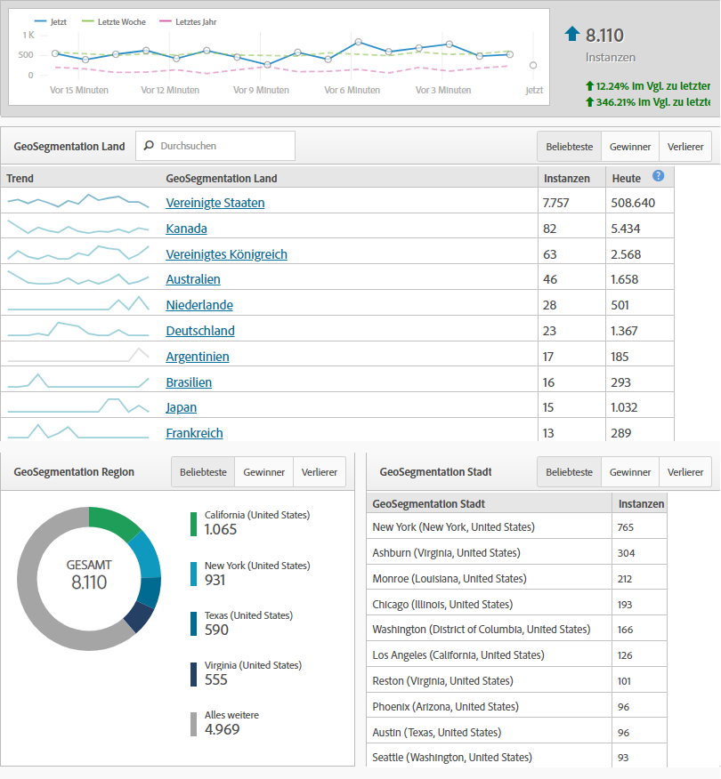
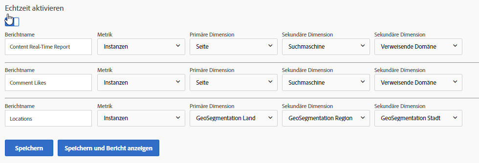

# Echtzeitberichte

Echtzeitberichte zeigen an, was auf Ihrer Site zur Zeit geschieht. Diese Berichtstypen sind besonders nützlich, um unmittelbare Ergebnisse der Aktualisierungen zu sehen, die Sie an Ihrer Site vornehmen. Beispielsweise kann ein Unternehmen, das einen Verkauf auf dem Black Friday ausführt, den Traffic zu bestimmten Seiten messen und bestimmen, welche Verkäufe basierend auf der Leistung in diesem Moment priorisiert werden sollen.

Echtzeitberichte sind eine der wenigen Funktionen, die noch nicht in Analysis Workspace eingeführt wurden. Verwenden Sie Reports &amp; Analysen, um diese Daten zu erhalten. Sie benötigen einige einfache Konfiguration, um mit der Datenerfassung zu beginnen.

So erreichen Sie die Echtzeitberichtkonfigurationsseite (Admin-Berechtigungen erforderlich):

1. Click [!UICONTROL Reports] in the Adobe Analytics header navigation.
2. In the left menu, Click *[!UICONTROL Site Metrics]* &gt; *[!UICONTROL Real-Time]*.
3. Wenn die Report Suite noch nicht aktiviert ist, wird eine Meldung mit einem Link zur Konfiguration der Report Suite angezeigt. If the report suite has real-time enabled, click [!UICONTROL Configure] near the real-time report&#39;s title.

Adobe ermöglicht bis zu drei Echtzeitberichte zur gleichzeitigen Datenerfassung. Alle müssen konfiguriert werden, bevor sie mit der Erfassung von Daten in Echtzeit beginnen.

## Positionen in Echtzeit

Orte in Echtzeit teilen Ihnen mit, wo sich Besucher während des aktuellen Besuchs befinden. So konfigurieren Sie einen Ihrer drei Echtzeitberichte zur Anzeige der Standortdaten:

1. Click [!UICONTROL Configure] near the real-time report&#39;s title.
2. Unter einer der Echtzeitberichtslots:
   * Benennen Sie den Echtzeitbericht. zum Beispiel &quot;Positionen&quot; .
   * Instanzen werden gewöhnlich als Metrik verwendet. Benutzer/Unique Visitors sind derzeit nicht in Echtzeitberichten verfügbar.
   * Für primäre Dimensionen wird geosegmentation Land normalerweise verwendet. Geosegmentation Region, geosegmentation US DMA und geosegmentation City sind ebenfalls verfügbar.
   * Verwenden Sie für die beiden sekundären Dimensionen die bevorzugten zusätzlichen Daten, die Sie für diesen Traffic sehen möchten. Sekundäre Dimensionen müssen nicht spezifisch sein.
3. Click [!UICONTROL Save and View Report].

## Echtzeit-Traffic-Quellen

In Echtzeit-Traffic-Quellen erfahren Sie, woher Besucher während des aktuellen Moment Ihrer Site kamen. So konfigurieren Sie einen Ihrer drei Echtzeitberichte zur Anzeige von Traffic-Quellendaten:

1. Klicken Sie auf&#39;Konfigurieren&#39;im Titel des Echtzeitberichts.
2. Unter einer der Echtzeitberichtslots:
   * Benennen Sie den Echtzeitbericht. zum Beispiel &quot;Traffic-Quellen&quot; .
   * Instanzen werden gewöhnlich als Metrik verwendet. Benutzer/Unique Visitors sind derzeit nicht in Echtzeitberichten verfügbar.
   * Für primäre Dimensionen wird die verweisende Domäne normalerweise verwendet. Suchmaschine und Suchbegriff sind ebenfalls verfügbar.
   * Verwenden Sie für die beiden sekundären Dimensionen die bevorzugten zusätzlichen Daten, die Sie für diesen Traffic sehen möchten. Sekundäre Dimensionen müssen nicht spezifisch für Traffic-Quellen sein.
3. Click [!UICONTROL Save and View Report].

## Inhalt in Echtzeit

Inhalte in Echtzeit teilen Ihnen mit, welche Seiten Ihre Besucher gerade ansehen. So konfigurieren Sie einen Ihrer drei Echtzeitberichte zur Anzeige von Inhaltsdaten:

1. Click [!UICONTROL Configure] near the real-time report&#39;s title.
2. Unter einer der Echtzeitberichtslots:
   * Benennen Sie den Echtzeitbericht. zum Beispiel &quot;Inhalt&quot; .
   * Instanzen werden gewöhnlich als Metrik verwendet. Benutzer/Unique Visitors sind derzeit nicht in Echtzeitberichten verfügbar.
   * Für primäre Dimensionen wird die Seite normalerweise verwendet. Site-Abschnitt und Server sind ebenfalls verfügbar, wenn Ihre Implementierung diese Variablen definiert.
   * Verwenden Sie für die beiden sekundären Dimensionen die bevorzugten zusätzlichen Daten, die Sie für diesen Traffic sehen möchten. Sekundäre Dimensionen müssen nicht spezifisch für Inhalte sein.
3. Click [!UICONTROL Save and View Report].

## Echtzeit-Ereignisse

Echtzeit-Ereignisse teilen Ihnen mit, welche Ereignisse am häufigsten auf Ihrer Site stattfinden. In Google Analytics erfasst ein Ereignis, wie oft eine bestimmte Aktion (im Allgemeinen eine Aktion, die nicht mit einer Seitenansicht verbunden ist) eingetreten ist. GA-Ereignisse werden mit Kategorie, Beschriftung und Aktion gesendet. In Adobe Analytics sind benutzerspezifische Ereignisse Metriken, die in der Admin-Konsole Anzeigenamen erhalten und zusammen mit beliebigen Dimensionen analysiert werden können. Wenn Sie nach einer Dimension in Adobe Analytics suchen, die den Google Analytics-Ereignissen ähnelt, sollten Sie die Dimension Benutzerspezifische Link-Dimension anwenden, die häufig als Auffangbehälter für die Erfassung von Daten verwendet wird, die nicht mit Seitenansichten (außer Ausstiegslinks - für Ausstiege - und Downloadlinks - Downloads) verbunden sind.

> [!NOTE] Wenn Sie benutzerdefinierte Ereignisse in Echtzeitberichten verwenden, muss der Dimensionswert im gleichen Treffer wie das benutzerdefinierte Ereignis definiert werden. Wenn Sie beispielsweise ein benutzerspezifisches Ereignis &quot;Registrierungen&quot; für die Dimension&quot; Verweisende Domäne&quot; anzeigen, werden ohne zusätzliche Implementierung keine Daten zurückgegeben. Da verweisende Domänen nur beim ersten Treffer angezeigt werden und ein benutzerdefiniertes Ereignis normalerweise später im Besuch erscheint, können die Daten nicht in Echtzeitberichten zugeordnet werden. Diese Daten sind mit dem Analysis Workspace verfügbar, wobei die Latenz der Standardverarbeitung verwendet wird, was in der Regel 30 bis 90 Minuten beträgt.

## Echtzeit-Konversionen

Echtzeit-Konversionen stellen Daten zwischen Plattformen unterschiedlich dar. Ziele in Google Analytics sind mit Metriken und Erfolgsereignissen in Adobe Analytics verknüpft. Sie können in Echtzeitberichten die meisten Metriken in Adobe Analytics (sowohl benutzerspezifische Metriken wie Erfolgsereignisse wie auch Standardmetriken wie Umsatz) verwenden. Ähnlich wie bei Google Analytics können Sie auch Dimensionen wie Produktname, Rückverfolgungscode und Kampagnenleistung in Echtzeitberichten anwenden.

1. Click [!UICONTROL Configure] near the real-time report&#39;s title.
2. Unter einer der Echtzeitberichtslots:
   * Benennen Sie den Echtzeitbericht. zum Beispiel &quot;Konversionen&quot; .
   * Instanzen werden gewöhnlich als Metrik verwendet. Benutzer/Unique Visitors sind derzeit nicht in Echtzeitberichten verfügbar.
   * Für primäre Dimensionen wird der Trackingcode normalerweise verwendet. Die Dimension &quot;Produkte&quot; ist auch verfügbar, wenn Ihre Implementierung sie verwendet.
   * Verwenden Sie für die beiden sekundären Dimensionen die bevorzugten zusätzlichen Daten, die Sie für diesen Traffic sehen möchten. Sekundäre Dimensionen müssen nicht spezifisch für Konversionen sein.
3. Click [!UICONTROL Save and View Report].

> [!NOTE] Wenn Sie Ereignisse außerhalb von Instanzen verwenden, wie z. B. Bestellungen, stellen Sie sicher, dass Ihre Implementierung die Dimension und das Ereignis für denselben Treffer definiert. Wenn Dimensionen und Ereignisse nicht bei demselben Treffer ausgelöst werden, sind diese Daten im Analysis Workspace mit Latenzzeiten der Standardverarbeitung verfügbar, was in der Regel 30 bis 90 Minuten beträgt.
